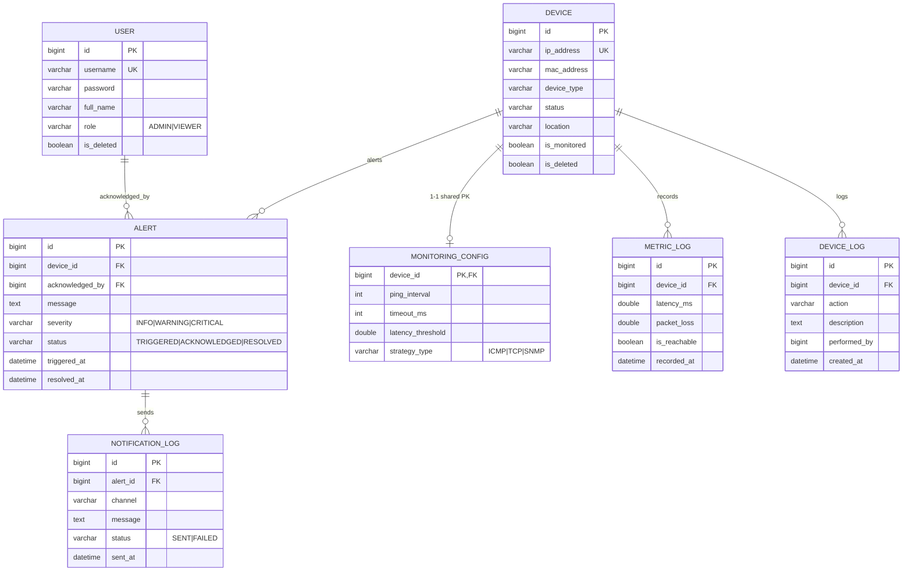

# QUY CHUẨN QUAN HỆ CƠ SỞ DỮ LIỆU — NETWORK DEVICE MANAGEMENT & MONITORING SYSTEM

> **Phiên bản:** 2.0.0  
> **Cập nhật:** 2026-09-22  
> **Phạm vi:** MySQL 8.x (InnoDB, utf8mb4) · JPA Entities · Spring Data JPA Repositories  
> **Vai trò tài liệu:** Mô tả chi tiết PK/FK, quan hệ, index, DDL tương ứng cho toàn bộ schema. Bổ trợ `rules/logic.md`.

---

## MỤC LỤC

1. [Tổng Quan Schema & Quan Hệ](#1-tổng-quan-schema--quan-hệ)
2. [Bảng `users`](#2-bảng-users)
3. [Bảng `devices`](#3-bảng-devices)
4. [Bảng `monitoring_configs`](#4-bảng-monitoring_configs)
5. [Bảng `metric_logs`](#5-bảng-metric_logs)
6. [Bảng `alerts`](#6-bảng-alerts)
7. [Bảng `device_logs`](#7-bảng-device_logs)
8. [Bảng `notification_logs`](#8-bảng-notification_logs)
9. [Quan Hệ Entity (Mermaid ERD)](#9-quan-hệ-entity-mermaid-erd)
10. [Spring Data JPA Repositories](#10-spring-data-jpa-repositories)
11. [DDL Tổng Hợp (MySQL 8.x)](#11-ddl-tổng-hợp-mysql-8x)
12. [Chính Sách Xóa & Toàn Vẹn](#12-chính-sách-xóa--toàn-vẹn)

---

## 1. Tổng Quan Schema & Quan Hệ

| Bảng | PK | FK | Chính sách xóa |
|---|---|---|---|
| `users` | `id` | — | Soft Delete |
| `devices` | `id` | — | Soft Delete + `is_monitored` |
| `monitoring_configs` | `device_id` (shared PK) | → `devices.id` | Cascade với Device |
| `metric_logs` | `id` | → `devices.id` | Cấm xóa thủ công (cron > 7 ngày) |
| `alerts` | `id` | → `devices.id`, `users.id` | Cấm xóa (chỉ chuyển status) |
| `device_logs` | `id` | → `devices.id` | Cấm xóa |
| `notification_logs` | `id` | → `alerts.id` | Cấm xóa |

**Quan hệ chính:**

```
devices 1 ─── 0..1 monitoring_configs   (OneToOne, shared PK @MapsId)
devices 1 ─── N metric_logs            (OneToMany, LAZY)
devices 1 ─── N device_logs            (OneToMany, LAZY)
devices 1 ─── N alerts                 (OneToMany, LAZY)
alerts  1 ─── N notification_logs      (OneToMany, LAZY)
alerts  N ─── 0..1 users               (ManyToOne acknowledged_by, LAZY)
```

---

## 2. Bảng `users`

### Entity: `com.network.network_monitor.entity.User`

| Cột | Kiểu | Null | Unique | Default | Ghi chú |
|---|---|---|---|---|---|
| `id` | `BIGINT` | NO | PK | AUTO_INCREMENT | `@Id` IDENTITY |
| `username` | `VARCHAR(50)` | NO | YES | — | |
| `password` | `VARCHAR(255)` | NO | — | — | BCrypt hash |
| `full_name` | `VARCHAR(100)` | YES | — | — | |
| `role` | `VARCHAR(20)` | NO | — | `VIEWER` | Enum `Role`: `ADMIN`, `VIEWER` |
| `is_deleted` | `BOOLEAN` | NO | — | `false` | Soft delete |
| `created_at` | `DATETIME` | NO | — | — | `@PrePersist` |
| `updated_at` | `DATETIME` | NO | — | — | `@PreUpdate` |

- **Soft Delete:** `@SQLDelete("UPDATE users SET is_deleted = true WHERE id = ?")`, `@SQLRestriction("is_deleted = false")`.
- **Index:** `idx_user_username (username)`, `idx_user_role (role)`.
- **KHÔNG còn** bảng `roles` / `user_roles` — phân quyền là enum trực tiếp trên cột `role`.

---

## 3. Bảng `devices`

### Entity: `com.network.network_monitor.entity.Device`

| Cột | Kiểu | Null | Unique | Default | Ghi chú |
|---|---|---|---|---|---|
| `id` | `BIGINT` | NO | PK | AUTO_INCREMENT | `@Id` IDENTITY |
| `name` | `VARCHAR(100)` | YES | — | — | gán sau discovery |
| `ip_address` | `VARCHAR(45)` | NO | YES | — | |
| `mac_address` | `VARCHAR(17)` | YES | — | — | ARP lookup |
| `device_type` | `VARCHAR(30)` | YES | — | — | Enum `DeviceType` |
| `status` | `VARCHAR(20)` | NO | — | — | Enum `DeviceStatus` |
| `location` | `VARCHAR(255)` | YES | — | — | |
| `is_monitored` | `BOOLEAN` | NO | — | `true` | tắt thay vì xóa |
| `is_deleted` | `BOOLEAN` | NO | — | `false` | Soft delete |
| `created_at` | `DATETIME` | NO | — | — | `@PrePersist` |
| `updated_at` | `DATETIME` | NO | — | — | `@PreUpdate` |

- **Soft Delete:** `@SQLDelete("UPDATE devices SET is_deleted = true WHERE id = ?")`, `@SQLRestriction("is_deleted = false")`.
- **Index:** `idx_device_status (status)`, `idx_device_type (device_type)`, `idx_device_ip (ip_address)`, `idx_device_monitored (is_monitored)`.
- **Quan hệ:** 1-1 xuôi `monitoring_configs`; 1-N ngược `metric_logs`, `alerts`, `device_logs` (all `FetchType.LAZY`, không cascade children).

---

## 4. Bảng `monitoring_configs`

### Entity: `com.network.network_monitor.entity.MonitoringConfig`

**Bảng dùng Shared Primary Key với `devices` — K1: `device_id` (vừa là PK vừa là FK).**

| Cột | Kiểu | Null | Default | Ghi chú |
|---|---|---|---|---|
| `device_id` | `BIGINT` | NO | — | `@Id` + FK → `devices.id` (`@MapsId`) |
| `ping_interval` | `INT` | NO | `15` | giây |
| `timeout_ms` | `INT` | NO | `2000` | ms |
| `latency_threshold` | `DOUBLE` | NO | `150.0` | ms |
| `strategy_type` | `VARCHAR(20)` | NO | — | Enum `ProbingMethod`: `ICMP`/`TCP`/`SNMP` |
| `created_at` | `DATETIME` | NO | — | `@PrePersist` |
| `updated_at` | `DATETIME` | NO | — | `@PreUpdate` |

- **Quan hệ:** `@OneToOne(fetch=LAZY) @MapsId @JoinColumn(name="device_id") private Device device;` — không có cột `id` riêng.
- **Mặc định khi discovery:** `strategyType=ICMP`, `pingInterval=15`, `timeoutMs=2000`, `latencyThreshold=150.0`.
- **Cascade:** xóa Device → xóa config kèm theo (chủ động từ `Device.monitoringConfig`).

---

## 5. Bảng `metric_logs`

### Entity: `com.network.network_monitor.entity.MetricLog`

| Cột | Kiểu | Null | Default | Ghi chú |
|---|---|---|---|---|
| `id` | `BIGINT` | NO | AUTO_INCREMENT | `@Id` IDENTITY |
| `device_id` | `BIGINT` | NO | — | FK → `devices.id` |
| `latency_ms` | `DOUBLE` | YES | — | RTT ms |
| `packet_loss` | `DOUBLE` | YES | — | % mất gói |
| `is_reachable` | `BOOLEAN` | NO | — | |
| `recorded_at` | `DATETIME` | NO | — | time-series timestamp |

- **Index:** `idx_device_time (device_id, recorded_at)`, `idx_metric_recorded_at (recorded_at)`.
- **Chính sách:** Cấm xóa thủ công; chỉ cron job `deleteByRecordedAtBefore(now - 7 days)`.
- **Không** áp dụng soft delete (dữ liệu đo lường thuần time-series).

---

## 6. Bảng `alerts`

### Entity: `com.network.network_monitor.entity.Alert`

| Cột | Kiểu | Null | Default | Ghi chú |
|---|---|---|---|---|
| `id` | `BIGINT` | NO | AUTO_INCREMENT | `@Id` IDENTITY |
| `device_id` | `BIGINT` | NO | — | FK → `devices.id` |
| `acknowledged_by` | `BIGINT` | YES | — | FK → `users.id`, nullable |
| `message` | `TEXT` | NO | — | `@Lob` |
| `severity` | `VARCHAR(20)` | NO | — | Enum `AlertSeverity`: `INFO`/`WARNING`/`CRITICAL` |
| `status` | `VARCHAR(20)` | NO | `TRIGGERED` | String: `TRIGGERED`/`ACKNOWLEDGED`/`RESOLVED` |
| `triggered_at` | `DATETIME` | NO | — | `@PrePersist` |
| `resolved_at` | `DATETIME` | YES | — | |

- **Index:** `idx_alert_device_status (device_id, status)`, `idx_alert_triggered (triggered_at)`, `idx_alert_severity (severity)`.
- **Chính sách:** Cấm xóa; chỉ chuyển `status`. De-dup: tối đa 1 alert active (TRIGGERED/ACKNOWLEDGED) per device.

---

## 7. Bảng `device_logs`

### Entity: `com.network.network_monitor.entity.DeviceLog`

| Cột | Kiểu | Null | Default | Ghi chú |
|---|---|---|---|---|
| `id` | `BIGINT` | NO | AUTO_INCREMENT | `@Id` IDENTITY |
| `device_id` | `BIGINT` | NO | — | FK → `devices.id` |
| `action` | `VARCHAR(30)` | NO | — | Ví dụ: `AUTO_DISCOVER`, `STATUS_CHANGE` |
| `description` | `LONGTEXT` | YES | — | `@Lob` |
| `performed_by` | `BIGINT` | YES | — | user id (nullable — hệ thống tự động) |
| `created_at` | `DATETIME` | NO | — | `@PrePersist` |

- **Index:** `idx_device_log_device_time (device_id, created_at)`, `idx_device_log_action (action)`.
- **Chính sách:** Cấm xóa (audit log, giữ vĩnh viễn).

---

## 8. Bảng `notification_logs`

### Entity: `com.network.network_monitor.entity.NotificationLog`

| Cột | Kiểu | Null | Default | Ghi chú |
|---|---|---|---|---|
| `id` | `BIGINT` | NO | AUTO_INCREMENT | `@Id` IDENTITY |
| `alert_id` | `BIGINT` | NO | — | FK → `alerts.id` |
| `channel` | `VARCHAR(20)` | NO | — | `WEBSOCKET` |
| `message` | `LONGTEXT` | YES | — | `@Lob` |
| `status` | `VARCHAR(20)` | NO | — | `SENT`/`FAILED` |
| `sent_at` | `DATETIME` | NO | — | `@PrePersist` |

- **Index:** `idx_notification_alert (alert_id)`, `idx_notification_sent (sent_at)`.
- **Chính sách:** Cấm xóa (audit chống spam).

---

## 9. Quan Hệ Entity (Mermaid ERD)



---

## 10. Spring Data JPA Repositories

| Repository | Kế thừa | Query Methods |
|---|---|---|
| `UserRepository` | `JpaRepository<User, Long>` | `findByUsername`, `existsByUsername`, `findByRole(Role)` |
| `DeviceRepository` | `JpaRepository<Device, Long>` | `findByIpAddress`, `existsByIpAddress`, `findByIsMonitoredTrue`, `findByStatus(DeviceStatus)` |
| `MonitoringConfigRepository` | `JpaRepository<MonitoringConfig, Long>` | `findByDevice`, `findByDeviceId`, `existsByDeviceId` |
| `MetricLogRepository` | `JpaRepository<MetricLog, Long>` | `findByDeviceIdOrderByRecordedAtDesc`, `deleteByRecordedAtBefore` (`@Modifying`) |
| `AlertRepository` | `JpaRepository<Alert, Long>` | `findByDeviceIdAndStatus(Long, String)`, `findByStatusIn(Collection<String>)` |
| `DeviceLogRepository` | `JpaRepository<DeviceLog, Long>` | `findByDeviceIdOrderByCreatedAtDesc`, `findByDeviceIdAndAction(Long, String)` |
| `NotificationLogRepository` | `JpaRepository<NotificationLog, Long>` | `findByAlertIdOrderBySentAtDesc`, `findByAlertIdAndChannel`, `existsByAlertIdAndChannelAndSuccess` |

> **Lưu ý:** `deleteByRecordedAtBefore` chỉ được gọi từ `MetricCleanupJob` (cron), không expose qua API.

---

## 11. DDL Tổng Hợp (MySQL 8.x)

> `ddl-auto=update` hiện tại tự tạo schema. DDL dưới đây dùng làm tài liệu tham chiếu cho Flyway/migration sau này.

```sql
CREATE DATABASE IF NOT EXISTS network_monitor
  CHARACTER SET utf8mb4 COLLATE utf8mb4_unicode_ci;

USE network_monitor;

CREATE TABLE users (
    id          BIGINT AUTO_INCREMENT PRIMARY KEY,
    username    VARCHAR(50)  NOT NULL,
    password    VARCHAR(255) NOT NULL,
    full_name   VARCHAR(100) NULL,
    role        VARCHAR(20)  NOT NULL DEFAULT 'VIEWER',
    is_deleted  BOOLEAN      NOT NULL DEFAULT FALSE,
    created_at  DATETIME     NOT NULL,
    updated_at  DATETIME     NOT NULL,
    CONSTRAINT uk_users_username UNIQUE (username)
);

CREATE TABLE devices (
    id            BIGINT AUTO_INCREMENT PRIMARY KEY,
    name          VARCHAR(100) NULL,
    ip_address    VARCHAR(45)  NOT NULL,
    mac_address   VARCHAR(17)  NULL,
    device_type   VARCHAR(30)  NULL,
    status        VARCHAR(20)  NOT NULL,
    location      VARCHAR(255) NULL,
    is_monitored  BOOLEAN      NOT NULL DEFAULT TRUE,
    is_deleted    BOOLEAN      NOT NULL DEFAULT FALSE,
    created_at    DATETIME     NOT NULL,
    updated_at    DATETIME     NOT NULL,
    CONSTRAINT uk_devices_ip UNIQUE (ip_address)
);

CREATE TABLE monitoring_configs (
    device_id          BIGINT      PRIMARY KEY,
    ping_interval      INT         NOT NULL DEFAULT 15,
    timeout_ms         INT         NOT NULL DEFAULT 2000,
    latency_threshold  DOUBLE      NOT NULL DEFAULT 150.0,
    strategy_type      VARCHAR(20) NOT NULL,
    created_at         DATETIME    NOT NULL,
    updated_at         DATETIME    NOT NULL,
    CONSTRAINT fk_monitoring_config_device
        FOREIGN KEY (device_id) REFERENCES devices (id)
        ON DELETE CASCADE
);

CREATE TABLE metric_logs (
    id            BIGINT   AUTO_INCREMENT PRIMARY KEY,
    device_id     BIGINT   NOT NULL,
    latency_ms    DOUBLE   NULL,
    packet_loss   DOUBLE   NULL,
    is_reachable  BOOLEAN  NOT NULL,
    recorded_at   DATETIME NOT NULL,
    CONSTRAINT fk_metric_log_device
        FOREIGN KEY (device_id) REFERENCES devices (id)
);

CREATE TABLE alerts (
    id              BIGINT   AUTO_INCREMENT PRIMARY KEY,
    device_id       BIGINT   NOT NULL,
    acknowledged_by BIGINT   NULL,
    message         TEXT     NOT NULL,
    severity        VARCHAR(20) NOT NULL,
    status          VARCHAR(20) NOT NULL,
    triggered_at    DATETIME NOT NULL,
    resolved_at     DATETIME NULL,
    CONSTRAINT fk_alert_device FOREIGN KEY (device_id) REFERENCES devices (id),
    CONSTRAINT fk_alert_user   FOREIGN KEY (acknowledged_by) REFERENCES users (id)
);

CREATE TABLE device_logs (
    id           BIGINT   AUTO_INCREMENT PRIMARY KEY,
    device_id    BIGINT   NOT NULL,
    action       VARCHAR(30) NOT NULL,
    description  TEXT     NULL,
    performed_by BIGINT   NULL,
    created_at   DATETIME NOT NULL,
    CONSTRAINT fk_device_log_device FOREIGN KEY (device_id) REFERENCES devices (id)
);

CREATE TABLE notification_logs (
    id         BIGINT   AUTO_INCREMENT PRIMARY KEY,
    alert_id   BIGINT   NOT NULL,
    channel    VARCHAR(20) NOT NULL,
    message    TEXT     NULL,
    status     VARCHAR(20) NOT NULL,
    sent_at    DATETIME NOT NULL,
    CONSTRAINT fk_notification_alert FOREIGN KEY (alert_id) REFERENCES alerts (id)
);

-- Indexes
CREATE INDEX idx_user_username ON users (username);
CREATE INDEX idx_user_role     ON users (role);
CREATE INDEX idx_device_status   ON devices (status);
CREATE INDEX idx_device_type     ON devices (device_type);
CREATE INDEX idx_device_ip       ON devices (ip_address);
CREATE INDEX idx_device_monitored ON devices (is_monitored);
CREATE INDEX idx_device_time     ON metric_logs (device_id, recorded_at);
CREATE INDEX idx_metric_recorded_at ON metric_logs (recorded_at);
CREATE INDEX idx_alert_device_status ON alerts (device_id, status);
CREATE INDEX idx_alert_triggered     ON alerts (triggered_at);
CREATE INDEX idx_alert_severity      ON alerts (severity);
CREATE INDEX idx_device_log_device_time ON device_logs (device_id, created_at);
CREATE INDEX idx_device_log_action      ON device_logs (action);
CREATE INDEX idx_notification_alert ON notification_logs (alert_id);
CREATE INDEX idx_notification_sent  ON notification_logs (sent_at);
```

---

## 12. Chính Sách Xóa & Toàn Vẹn

| Bảng | Cơ chế | Người gọi | Endpoint |
|---|---|---|---|
| `users` | Soft delete `is_deleted = true` | UserService | admin API |
| `devices` | Soft delete `is_deleted = true` | DeviceService | admin API |
| `devices` | `is_monitored = false` (tắt giám sát) | DeviceService | admin API |
| `metric_logs` | `deleteByRecordedAtBefore` (`@Modifying`) | `MetricCleanupJob` (cron 02:00 UTC) | ❌ không expose |
| `alerts` | Chỉ cập nhật `status` (`TRIGGERED`→`ACKNOWLEDGED`→`RESOLVED`) | AlertService | alert API |
| `device_logs` | **Cấm xóa** | — | — |
| `notification_logs` | **Cấm xóa** | — | — |

> Xem chi tiết nghiệp vụ tại **`rules/logic.md` §3**.