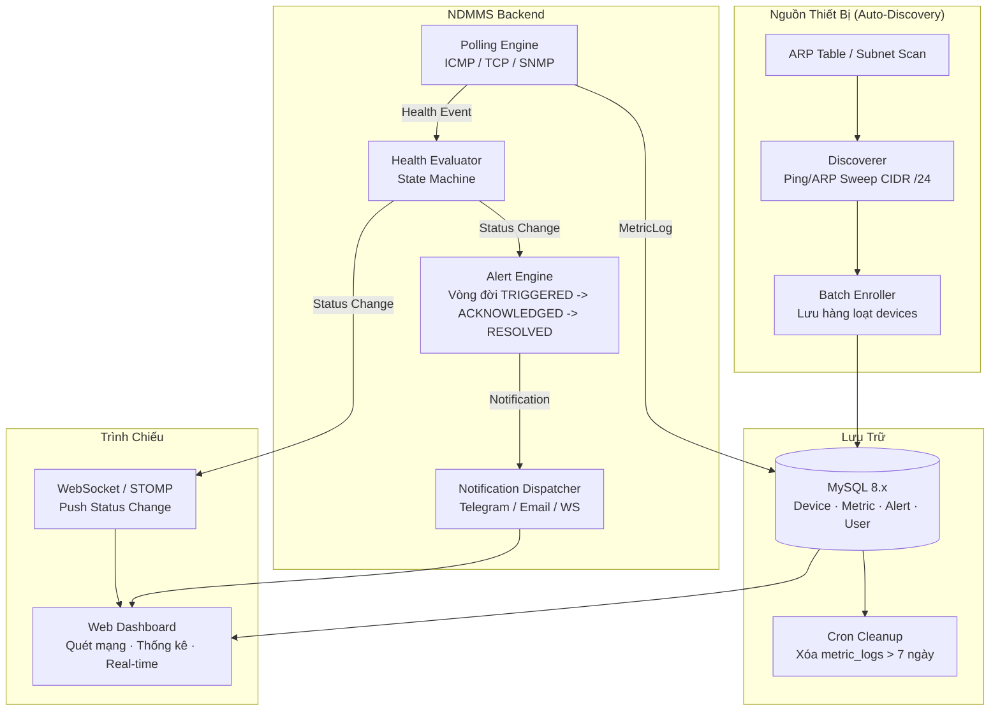
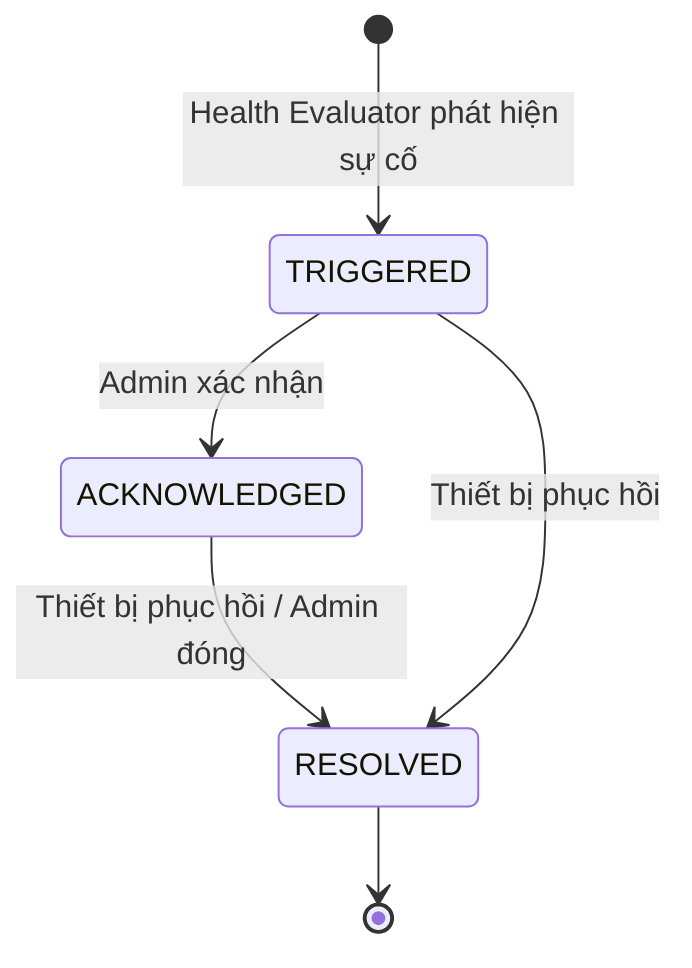

# QUY CHUẨN BUSINESS LOGIC — NETWORK DEVICE MANAGEMENT & MONITORING SYSTEM

> **Phiên bản:** 2.0.0  
> **Cập nhật:** 2026-09-22  
> **Phạm vi:** Backend (Spring Boot 3.5.x · Java 25 · MySQL 8.x) · Frontend (Web Dashboard)  
> **Vai trò tài liệu:** Single Source of Truth — mọi thiết kế DB, implement code, review PR phải tuân thủ tài liệu này.

---

## MỤC LỤC

1. [Tổng Quan Hệ Thống & Miền Nghiệp Vụ](#1-tổng-quan-hệ-thống--miền-nghiệp-vụ)
2. [Network Auto-Discovery — Quét & Nhập Hàng Loạt](#2-network-auto-discovery--quét--nhập-hàng-loạt)
3. [Quy Tắc Xóa & Ràng Buộc Toàn Vẹn Dữ Liệu](#3-quy-tắc-xóa--ràng-buộc-toàn-vẹn-dữ-liệu)
4. [Mô Hình Dữ Liệu (Entities)](#4-mô-hình-dữ-liệu-entities)
5. [Cơ Chế Thăm Dò & Thu Thập Số Liệu](#5-cơ-chế-thăm-dò--thu-thập-số-liệu)
6. [Máy Trạng Thái & Đánh Giá Sức Khỏe](#6-máy-trạng-thái--đánh-giá-sức-khỏe)
7. [Động Cơ Xử Lý & Phát Cảnh Báo](#7-động-cơ-xử-lý--phát-cảnh-báo)
8. [Danh Mục Mã Lỗi & Ma Trận Mức Độ Nghiêm Trọng](#8-danh-mục-mã-lỗi--ma-trận-mức-độ-nghiêm-trọng)
9. [Phụ Lục](#9-phụ-lục)

---

## 1. Tổng Quan Hệ Thống & Miền Nghiệp Vụ

### 1.1 Bài Toán Nghiệp Vụ

Hệ thống **Network Device Management and Monitoring System (NDMMS)** giải quyết bài toán:

- **Tự động phát hiện thiết bị (Network Auto-Discovery):** Quét dải mạng nội bộ (Ping/ARP Sweep CIDR /24) để phát hiện thiết bị đang kết nối, nạp hàng loạt (Batch Enrollment) thay cho nhập liệu thủ công.
- **Giám sát trạng thái hoạt động** (Health Check / Uptime) thời gian thực cho hạ tầng thiết bị mạng.
- **Đo lường hiệu năng mạng** (Latency, Packet Loss) trên từng thiết bị.
- **Phát hiện sự cố tự động** dựa trên ngưỡng cấu hình và kích hoạt cảnh báo.
- **Quản lý vòng đời thiết bị** với Soft Delete và cờ `isMonitored` (tắt giám sát khi thiết bị ngắt kết nối).
- **Bảo toàn dữ liệu đo đạc:** Cấm xóa thủ công các bảng time-series / audit log.

### 1.2 Biểu Đồ Ngữ Cảnh (Domain Context — Mermaid)



### 1.3 Các Thực Thể Cốt Lõi (Core Domain Entities)

| Thực thể           | Bảng DB              | Mô tả                                                                 |
| ------------------ | -------------------- | --------------------------------------------------------------------- |
| `Device`           | `devices`            | Thiết bị mạng được phát hiện tự động / quản lý trong hệ thống.        |
| `MonitoringConfig` | `monitoring_configs` | Cấu hình giám sát riêng cho từng thiết bị (shared PK `device_id`).    |
| `MetricLog`        | `metric_logs`        | Bản ghi số liệu đo đạc time-series (latency, packet loss, reachable). |
| `DeviceLog`        | `device_logs`        | Nhật ký sự kiện, thay đổi trạng thái và hành động hệ thống.           |
| `Alert`            | `alerts`             | Sự cố được kích hoạt; **cấm xóa**, chỉ chuyển trạng thái vòng đời.    |
| `User`             | `users`              | Tài khoản người dùng, phân quyền bằng enum `Role`.                    |
| `NotificationLog`  | `notification_logs`  | Nhật ký gửi thông báo (Telegram/Email/WebSocket), không xóa thủ công. |

> **Ghi chú:** Không còn bảng `roles`, `user_roles`, `role` entity. Phân quyền lưu trực tiếp enum `Role` trên cột `users.role` (`ADMIN`, `VIEWER`).

---

## 2. Network Auto-Discovery — Quét & Nhập Hàng Loạt

### 2.1 Luồng Xử Lý Auto-Discovery

```
┌─────────────────────────────────────────────────────────────────────┐
│  DISCOVERY FLOW                                                     │
│                                                                     │
│  POST /api/discovery/scan  { subnet: "192.168.1.0/24" }            │
│         │                                                           │
│         ▼                                                           │
│  1. Parse CIDR → generate IP range (IP, Số thiết bị tối đa /24=254)│
│         │                                                           │
│         ▼                                                           │
│  2. Ping Sweep (song song, Virtual Threads Java 25):                │
│       • ICMP ping từng host (timeout 2000ms)                        │
│       • ARP lookup → MAC address (nếu có)                           │
│         │                                                           │
│         ▼                                                           │
│  3. Thu thập: ipAddress, macAddress, latencyMs, reachable           │
│         │                                                           │
│         ▼                                                           │
│  4. Batch Enrollment (chỉ IP mới hoặc chưa tồn tại):                │
│       • Tạo Device mới (status=UNKNOWN, isMonitored=true)           │
│       • Tạo MonitoringConfig mặc định (strategyType=ICMP)           │
│       • Bỏ qua IP đã tồn tại (tồn tại → skip hoặc update)           │
│         │                                                           │
│         ▼                                                           │
│  Response: { discovered, added, skipped, duplicates }               │
└─────────────────────────────────────────────────────────────────────┘
```

### 2.2 Quy Tắc Batch Enrollment

| Quy tắc                     | Chi tiết                                                                                                    |
| --------------------------- | ----------------------------------------------------------------------------------------------------------- |
| **Phạm vi quét**            | CIDR `/24` (254 host) — hỗ trợ mở rộng `/16`, `/8`.                                                         |
| **IP trùng lặp**            | Nếu `ipAddress` đã tồn tại (kể cả `isDeleted=false`): **bỏ qua (skip)** trong batch, KHÔNG tạo mới.         |
| **MAC không có**            | `macAddress` có thể `NULL` nếu ARP không trả về (không bắt buộc).                                           |
| **Trạng thái khởi tạo**     | Device mới có `status = UNKNOWN`, `isMonitored = true`.                                                     |
| **MonitoringConfig**        | Tạo kèm `strategyType = ICMP`, `pingInterval = 15`, `timeoutMs = 2000`, `latencyThreshold = 150.0`.         |
| **Thiết bị không phản hồi** | Host không reachable trong sweep → KHÔNG tạo Device (chỉ ghi nhận `discovered`).                            |
| **Loại trừ**                | Bỏ qua IP loopback `127.0.0.1`, gateway range, broadcast `255.255.255.255`.                                 |
| **DeviceLog**               | Ghi `action = "AUTO_DISCOVER"`, `description = "Discovered via sweep {subnet}"` cho từng thiết bị được tạo. |

### 2.3 ID Chủ Đề Bài Toán: "Thay Thế Nhập Liệu Thủ Công"

- **BỎ** nhập tay từng thiết bị (create-only API cho device KHÔNG còn là đường chính).
- Nạp thiết bị chủ yếu qua **Discovery Endpoint** (`/api/discovery/scan`).
- API quản lý device chỉ còn dùng cho: chỉnh sửa metadata, `isMonitored`, soft delete.

---

## 3. Quy Tắc Xóa & Ràng Buộc Toàn Vẹn Dữ Liệu

### 3.1 Ma Trận Chính Sách Xóa

| Bảng                | Chính sách           | Cơ chế                                                 | Ghi chú                                                       |
| ------------------- | -------------------- | ------------------------------------------------------ | ------------------------------------------------------------- |
| `devices`           | **Soft Delete**      | `@SQLDelete` + `@SQLRestriction("is_deleted = false")` | Không xóa vật lý; bảo toàn `metric_logs` lịch sử.             |
| `users`             | **Soft Delete**      | `@SQLDelete` + `@SQLRestriction("is_deleted = false")` | Bảo toàn ID người tiếp nhận sự cố (`alerts.acknowledged_by`). |
| `metric_logs`       | **CẤM XÓA THỦ CÔNG** | Chỉ cron job xóa dữ liệu > 7 ngày                      | `deleteByRecordedAtBefore(...)`; KHÔNG soft delete.           |
| `device_logs`       | **CẤM XÓA**          | —                                                      | Audit log, giữ vĩnh viễn.                                     |
| `alerts`            | **CẤM XÓA**          | Chỉ cập nhật trạng thái                                | `TRIGGERED` → `ACKNOWLEDGED` → `RESOLVED`.                    |
| `notification_logs` | **CẤM XÓA**          | —                                                      | Audit chống spam.                                             |

### 3.2 Quy Tắc Chi Tiết

#### 3.2.1 `devices` — Soft Delete + `is_monitored`

| Tình huống                                 | Hành động                                                             |
| ------------------------------------------ | --------------------------------------------------------------------- |
| Thiết bị ngắt kết nối Wi-Fi/LAN (tạm thời) | Đổi `isMonitored = false` — **giữ** bản ghi + toàn bộ dữ liệu đo đạc. |
| Ngừng theo dõi vĩnh viễn                   | Soft Delete `isDeleted = true`.                                       |
| Phục hồi                                   | `isDeleted = false`, `isMonitored = true`, reset `status = UNKNOWN`.  |

```java
@Entity
@SQLDelete(sql = "UPDATE devices SET is_deleted = true WHERE id = ?")
@SQLRestriction("is_deleted = false")
public class Device { /* ... */ }
```

#### 3.2.2 `users` — Soft Delete

- Giữ nguyên ID của người dùng bị vô hiệu để `alerts.acknowledged_by` không bị orphan / mất nguồn.
- Truy vấn mặc định loại trừ user đã xóa.

#### 3.2.3 `metric_logs` — Chỉ Cron Job Dọn Dẹp

- **CẤM** delete thủ công qua Repository/Service.
- Cron job hàng đêm (02:00 UTC) gọi `deleteByRecordedAtBefore(now - 7 days)`.
- Repository method được annotation `@Modifying` + `@Transactional` — chỉ được gọi từ scheduler, không expose qua API.

#### 3.2.4 `alerts` — Không Xóa, Chỉ Chuyển Trạng Thái



- `status` là `String` (`TRIGGERED`, `ACKNOWLEDGED`, `RESOLVED`) — KHÔNG tồn tại đường DELETE.
- Chuyển `RESOLVED` ghi `resolvedAt`; chuyển `ACKNOWLEDGED` ghi `acknowledgedBy`.

---

## 4. Mô Hình Dữ Liệu (Entities)

> Chi tiết quan hệ, PK/FK, index xem **`rules/database_relations.md`**.

### 4.1 `User` (Bảng `users`)

- Fields: `id`, `username` (unique, not null), `password` (not null), `fullName`, `role` (enum, default `VIEWER`), `isDeleted` (default `false`), `createdAt`, `updatedAt`.
- Soft Delete: `@SQLDelete` + `@SQLRestriction("is_deleted = false")`.

| Field       | Kiểu          | Ràng buộc                                         |
| ----------- | ------------- | ------------------------------------------------- |
| `id`        | `Long`        | `@Id` IDENTITY                                    |
| `username`  | `String(50)`  | unique, not null                                  |
| `password`  | `String(255)` | not null (BCrypt hash)                            |
| `fullName`  | `String(100)` | nullable                                          |
| `role`      | `Role` enum   | `@Enumerated(STRING)`, not null, default `VIEWER` |
| `isDeleted` | `Boolean`     | default `false`                                   |

### 4.2 `Device` (Bảng `devices`)

- Fields: `id`, `name`, `ipAddress` (unique, not null), `macAddress`, `deviceType` (enum), `status` (enum), `location`, `isMonitored` (default `true`), `isDeleted` (default `false`), `createdAt`, `updatedAt`.
- Soft Delete + cờ `isMonitored`.

| Field         | Kiểu                | Ràng buộc                       |
| ------------- | ------------------- | ------------------------------- |
| `id`          | `Long`              | `@Id` IDENTITY                  |
| `name`        | `String(100)`       | nullable (gán sau discovery)    |
| `ipAddress`   | `String(45)`        | unique, not null                |
| `macAddress`  | `String(17)`        | nullable                        |
| `deviceType`  | `DeviceType` enum   | `@Enumerated(STRING)`           |
| `status`      | `DeviceStatus` enum | `@Enumerated(STRING)`, not null |
| `location`    | `String(255)`       | nullable                        |
| `isMonitored` | `Boolean`           | default `true`                  |
| `isDeleted`   | `Boolean`           | default `false`                 |

### 4.3 `MonitoringConfig` (Bảng `monitoring_configs`)

- **Shared Primary Key** với `devices`: `@Id Long deviceId` + `@MapsId` trên quan hệ `@OneToOne(Device)`.
- Không có `id` riêng.

| Field              | Kiểu                 | Default | Ràng buộc                     |
| ------------------ | -------------------- | ------- | ----------------------------- |
| `deviceId`         | `Long`               | —       | `@Id`, FK → `devices.id`      |
| `device`           | `Device`             | —       | `@OneToOne @MapsId`, not null |
| `pingInterval`     | `Integer`            | `15`    | giây                          |
| `timeoutMs`        | `Integer`            | `2000`  | ms                            |
| `latencyThreshold` | `Double`             | `150.0` | ms                            |
| `strategyType`     | `ProbingMethod` enum | —       | ICMP / TCP / SNMP             |

### 4.4 `MetricLog` (Bảng `metric_logs`)

- Time-series, **cấm xóa thủ công**, dọn dẹp qua cron (> 7 ngày).
- Index: `idx_device_time (device_id, recorded_at)`, `idx_metric_recorded_at (recorded_at)`.

| Field         | Kiểu            | Mô tả                            |
| ------------- | --------------- | -------------------------------- |
| `id`          | `Long`          | `@Id` IDENTITY                   |
| `device`      | `Device`        | `@ManyToOne(LAZY)` → `device_id` |
| `latencyMs`   | `Double`        | RTT ms                           |
| `packetLoss`  | `Double`        | % loss                           |
| `isReachable` | `Boolean`       | reachable hay không              |
| `recordedAt`  | `LocalDateTime` | thời điểm đo                     |

### 4.5 `Alert` (Bảng `alerts`)

- **Cấm xóa**, chỉ chuyển trạng thái. `status` là `String`.
- Index: `idx_alert_device_status (device_id, status)`, `idx_alert_triggered (triggered_at)`, `idx_alert_severity (severity)`.

| Field            | Kiểu                 | Mô tả                                            |
| ---------------- | -------------------- | ------------------------------------------------ |
| `id`             | `Long`               | `@Id` IDENTITY                                   |
| `device`         | `Device`             | `@ManyToOne(LAZY)` → `device_id`                 |
| `acknowledgedBy` | `User`               | `@ManyToOne(LAZY)` → `acknowledged_by`, nullable |
| `message`        | `String` (`@Lob`)    | mô tả sự cố                                      |
| `severity`       | `AlertSeverity` enum | `@Enumerated(STRING)`                            |
| `status`         | `String(20)`         | `TRIGGERED` / `ACKNOWLEDGED` / `RESOLVED`        |
| `triggeredAt`    | `LocalDateTime`      | not null                                         |
| `resolvedAt`     | `LocalDateTime`      | nullable                                         |

### 4.6 `DeviceLog` (Bảng `device_logs`)

- Audit log, **cấm xóa**.
- Index: `idx_device_log_device_time (device_id, created_at)`, `idx_device_log_action (action)`.

| Field         | Kiểu              | Mô tả                                           |
| ------------- | ----------------- | ----------------------------------------------- |
| `id`          | `Long`            | `@Id` IDENTITY                                  |
| `device`      | `Device`          | `@ManyToOne(LAZY)` → `device_id`                |
| `action`      | `String(30)`      | `AUTO_DISCOVER`, `STATUS_CHANGE`, ...           |
| `description` | `String` (`@Lob`) | chi tiết hành động                              |
| `performedBy` | `Long`            | user id thực hiện (nullable — hệ thống tự động) |
| `createdAt`   | `LocalDateTime`   | not null                                        |

### 4.7 `NotificationLog` (Bảng `notification_logs`)

- Audit thông báo, **cấm xóa**.
- Index: `idx_notification_alert (alert_id)`, `idx_notification_sent (sent_at)`.

| Field     | Kiểu              | Mô tả                              |
| --------- | ----------------- | ---------------------------------- |
| `id`      | `Long`            | `@Id` IDENTITY                     |
| `alert`   | `Alert`           | `@ManyToOne(LAZY)` → `alert_id`    |
| `channel` | `String(20)`      | `TELEGRAM` / `EMAIL` / `WEBSOCKET` |
| `message` | `String` (`@Lob`) | nội dung đã gửi                    |
| `status`  | `String(20)`      | `SENT` / `FAILED`                  |
| `sentAt`  | `LocalDateTime`   | not null                           |

---

## 5. Cơ Chế Thăm Dò & Thu Thập Số Liệu

### 5.1 Lập Lịch & Async (Virtual Threads Java 25)

- Scheduler `@Scheduled` đọc danh sách `Device` có `isMonitored = true` và `isDeleted = false` (repository `findByIsMonitoredTrue()`).
- Mỗi thiết bị được probe trên **Virtual Thread** (`Executors.newVirtualThreadPerTaskExecutor()`).
- Blocking I/O (ICMP/TCP/SNMP) không làm nghẽn thread carrier.

| Tham số                | Default         | Mô tả                |
| ---------------------- | --------------- | -------------------- |
| `poll.global.interval` | `15000ms` (15s) | Chu kỳ quét toàn cục |
| `poll.timeout.icmp`    | `3000ms`        | Timeout ICMP         |
| `poll.timeout.tcp`     | `2000ms`        | Timeout TCP          |
| `poll.timeout.snmp`    | `5000ms`        | Timeout SNMP         |

### 5.2 Chiến Lược Thăm Dò (Strategy Pattern)

Giao diện `ProbingStrategy.probe(Device) → ProbeResult { reachable, latencyMs, packetLossPercent }`:

| Strategy          | Mô tả                                 | Áp dụng cho                             |
| ----------------- | ------------------------------------- | --------------------------------------- |
| `PingStrategy`    | `InetAddress.isReachable(timeout)`    | Thiết bị mặc định (ICMP)                |
| `TcpPortStrategy` | `Socket.connect(host, port, timeout)` | Server / Firewall chặn ICMP             |
| `SnmpStrategy`    | SNMP GetRequest (CPU/RAM/Bandwidth)   | Router/Switch có agent SNMP (phase sau) |

**Chọn Strategy (`MonitoringConfig.strategyType`):** Thiết bị dùng strategy được cấu hình trong `monitoring_configs`; mặc định sau discovery là `ICMP`.

### 5.3 Lưu Trữ `metric_logs` (Data Retention)

| Loại dữ liệu        | Thời gian giữ | Hành động                                                   |
| ------------------- | ------------- | ----------------------------------------------------------- |
| `metric_logs`       | **7 ngày**    | Cron job hàng đêm xóa `recordedAt < NOW() - INTERVAL 7 DAY` |
| `device_logs`       | Vĩnh viễn     | Giữ                                                         |
| `alerts`            | Vĩnh viễn     | Giữ (chỉ đổi status)                                        |
| `notification_logs` | Vĩnh viễn     | Giữ                                                         |

```sql
-- Repository (chỉ scheduler gọi)
@Modifying
@Transactional
@Query("DELETE FROM MetricLog m WHERE m.recordedAt < :before")
void deleteByRecordedAtBefore(LocalDateTime before);
```

---

## 6. Máy Trạng Thái & Đánh Giá Sức Khỏe

### 6.1 `DeviceStatus` Enum

| Trạng thái    | Ý nghĩa                                     | Nhóm   | Màu                  |
| ------------- | ------------------------------------------- | ------ | -------------------- |
| `UNKNOWN`     | Mới tạo / mới discovery, chưa có dữ liệu đo | health | Xám `#9E9E9E`        |
| `ONLINE`      | Latency trong ngưỡng, không mất gói đáng kể | health | Xanh lá `#4CAF50`    |
| `WARNING`     | Latency > ngưỡng, packet loss cao           | health | Vàng `#FF9800`       |
| `OFFLINE`     | Không phản hồi sau N lần thử liên tiếp      | health | Đỏ `#F44336`         |
| `MAINTENANCE` | Đang bảo trì — vô hiệu hóa 100% cảnh báo    | asset  | Xanh dương `#2196F3` |

### 6.2 Ngưỡng Đánh Giá (MonitoringConfig)

| Tham số                | Default                    |
| ---------------------- | -------------------------- |
| `latencyThreshold`     | `150ms` (vượt → `WARNING`) |
| `consecutive_failures` | `3` (→ `OFFLINE`)          |
| `consecutive_success`  | `2` (→ hồi phục `ONLINE`)  |

Thuật toán chống flapping: chỉ chuyển trạng thái khi đủ N lần liên tiếp (thất bại / thành công), không flip ngay lập tức. Chỉ probe thiết bị `isMonitored = true`.

---

## 7. Động Cơ Xử Lý & Phát Cảnh Báo

### 7.1 Vòng Đời Alert

- `TRIGGERED` → `ACKNOWLEDGED` (admin xác nhận) → `RESOLVED` (device phục hồi / admin đóng).
- **CẤM xóa dòng alert** — chỉ cập nhật trạng thái.

### 7.2 De-duplication (Chống Spam)

- Mỗi thiết bị chỉ có tối đa **1 alert active** (TRIGGERED/ACKNOWLEDGED) tại một thời điểm.
- `AlertRepository.findByDeviceIdAndStatus(deviceId, status)` dùng kiểm tra active trước khi tạo mới.

### 7.3 Kênh Thông Báo (Notification Dispatcher)

| Kênh      | Severity | Log                                            |
| --------- | -------- | ---------------------------------------------- |
| Telegram  | Tất cả   | `notification_logs` (channel=`TELEGRAM`)       |
| Email     | CRITICAL | `notification_logs` (channel=`EMAIL`)          |
| WebSocket | Tất cả   | push `/topic/alerts`, `/topic/device-status/*` |

---

## 8. Danh Mục Mã Lỗi & Ma Trận Mức Độ Nghiêm Trọng

### 8.1 Mã Lỗi Nghiệp Vụ

| Mã lỗi                    | HTTP  | Mô tả                                                            |
| ------------------------- | ----- | ---------------------------------------------------------------- |
| `ERR_DUPLICATE_IP`        | `409` | IP đã tồn tại (trong Auto-Discovery → skip, không báo lỗi block) |
| `ERR_INVALID_CIDR`        | `400` | Subnet CIDR không hợp lệ khi quét                                |
| `ERR_DEVICE_NOT_FOUND`    | `404` | Thiết bị không tồn tại hoặc đã soft delete                       |
| `ERR_ALREADY_RESOLVED`    | `409` | Alert đã RESOLVED, không thể ACKNOWLEDGE                         |
| `ERR_UNAUTHORIZED_ACTION` | `403` | Không đủ quyền (Viewer thao tác quản trị)                        |
| `ERR_DELETE_FORBIDDEN`    | `409` | Cố xóa bảng cấm xóa (metric_logs, alerts, ...)                   |

### 8.2 Ma Trận Severity

| Severity   | Điều kiện                                | Hành động                                 |
| ---------- | ---------------------------------------- | ----------------------------------------- |
| `INFO`     | Thêm thiết bị qua discovery, maintenance | Ghi `device_logs`, không notify           |
| `WARNING`  | Latency > threshold, packet loss cao     | Alert `TRIGGERED` + Telegram + WS         |
| `CRITICAL` | Device `OFFLINE`, port down              | Alert `TRIGGERED` + Telegram + Email + WS |

---

## 9. Phụ Lục

### 9.1 API Response Standard

```json
{
  "success": true,
  "data": {},
  "error": null,
  "timestamp": "2026-09-22T10:30:00Z",
  "path": "/api/discovery/scan"
}
```

Error:

```json
{
  "success": false,
  "data": null,
  "error": {
    "code": "ERR_INVALID_CIDR",
    "message": "Invalid subnet CIDR format."
  },
  "timestamp": "2026-09-22T10:30:00Z",
  "path": "/api/discovery/scan"
}
```

### 9.2 Cấu Trúc Package `com.network.network_monitor`

```
com.network.network_monitor/
├── NetworkMonitorApplication.java
├── enums/           → DeviceType, DeviceStatus, AlertSeverity, Role, ProbingMethod
├── entity/          → Device, MonitoringConfig, MetricLog, DeviceLog, Alert, User, NotificationLog
├── repository/      → DeviceRepository, MonitoringConfigRepository, MetricLogRepository,
│                      DeviceLogRepository, AlertRepository, UserRepository, NotificationLogRepository
├── service/         → (DeviceService, DiscoveryService, MonitoringService, AlertService, ...)
├── controller/      → (DeviceController, DiscoveryController, AlertController, ...)
├── scheduler/       → (PollingScheduler, HealthEvaluator, AlertEngine, MetricCleanupJob)
├── strategy/        → (ProbingStrategy, PingStrategy, TcpPortStrategy, SnmpStrategy)
├── notification/    → (NotificationDispatcher, TelegramNotifier, EmailNotifier, WebSocketNotifier)
└── exception/       → (GlobalExceptionHandler, BusinessException, ErrorCode, ...)
```

### 9.3 Checklist Review Khi Implement

| #   | Hạng mục                                                                                | Trạng thái |
| --- | --------------------------------------------------------------------------------------- | ---------- |
| 1   | Discovery API quét CIDR, batch enrollment, skip IP trùng                                | ☐          |
| 2   | Soft delete `devices`, `users` — không hard delete                                      | ☐          |
| 3   | `isMonitored=false` thay cho xóa khi thiết bị ngắt kết nối                              | ☐          |
| 4   | Cấm xóa `metric_logs` (chỉ cron > 7 ngày), `alerts`, `device_logs`, `notification_logs` | ☐          |
| 5   | Alert chỉ chuyển status TRIGGERED→ACKNOWLEDGED→RESOLVED                                 | ☐          |
| 6   | MonitoringConfig dùng shared PK (`@MapsId`)                                             | ☐          |
| 7   | Virtual Threads cho polling + discovery sweep                                           | ☐          |
| 8   | De-dup alert: 1 alert active per device                                                 | ☐          |
| 9   | Index `idx_device_time`, `idx_alert_device_status`                                      | ☐          |
| 10  | API response chuẩn `{ success, data, error, timestamp, path }`                          | ☐          |

---

> **Quy tắc cuối cùng:** Nếu có bất kỳ sự mâu thuẫn nào giữa tài liệu này và code đang implement, **tài liệu này là nguồn chính**. Code phải được sửa để tuân thủ tài liệu.
