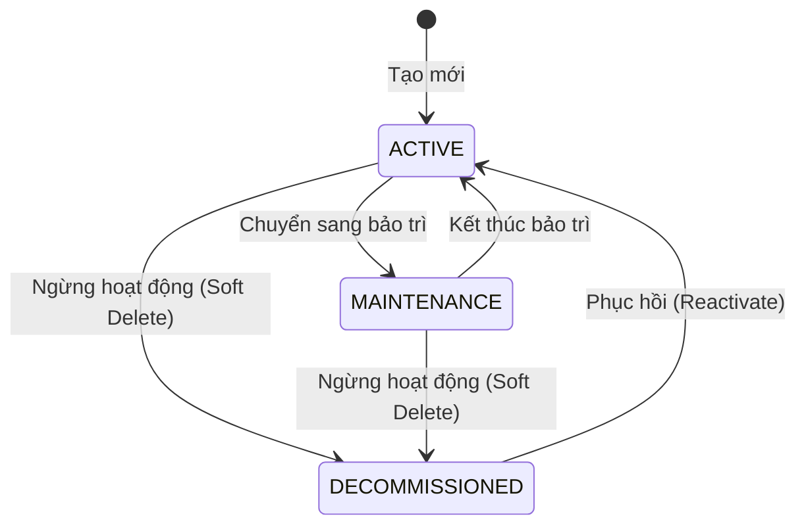
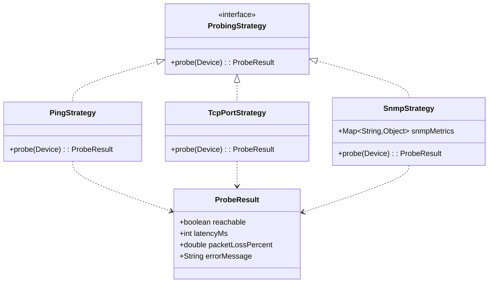
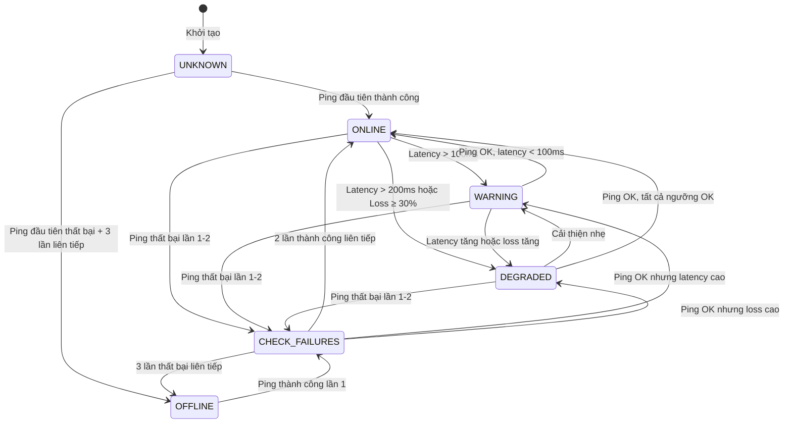
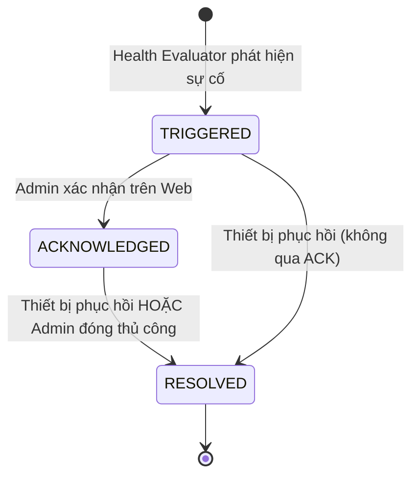
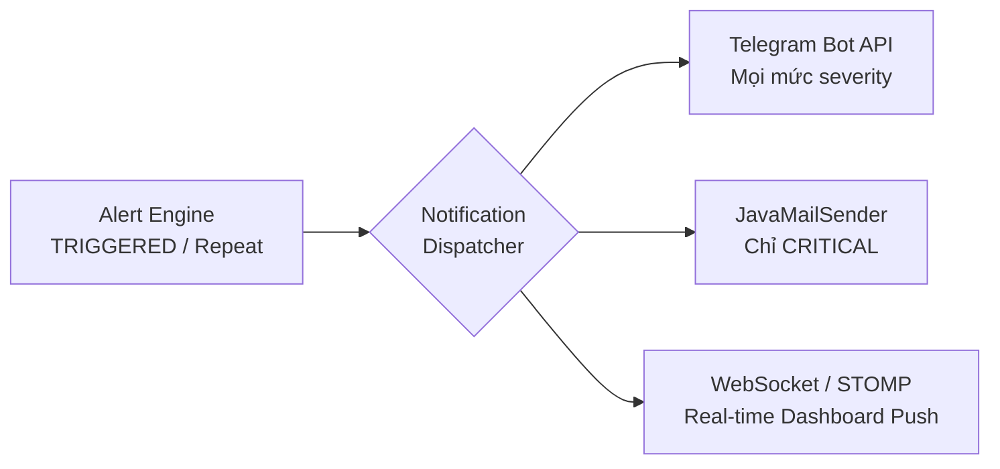

# QUY CHUẨN BUSINESS LOGIC — NETWORK DEVICE MANAGEMENT & MONITORING SYSTEM

> **Phiên bản:** 1.0.0  
> **Cập nhật:** 2026-09-16  
> **Phạm vi:** Backend (Spring Boot 3.5.x · Java 25 · MySQL 8.x) · Frontend (Web Dashboard)  
> **Vai trò tài liệu:** Single Source of Truth — mọi thiết kế DB, implement code, review PR phải tuân thủ tài liệu này.

---

## MỤC LỤC

1. [Tổng Quan Hệ Thống & Miền Nghiệp Vụ](#1-tổng-quan-hệ-thống--miền-nghiệp-vụ)
2. [Quản Lý Tài Sản Thiết Bị](#2-quản-lý-tài-sản-thiết-bị)
3. [Cơ Chế Thăm Dò & Thu Thập Số Liệu](#3-cơ-chế-thăm-dò--thu-thập-số-liệu)
4. [Máy Trạng Thái & Đánh Giá Sức Khỏe](#4-máy-trạng-thái--đánh-giá-sức-khỏe)
5. [Động Cơ Xử Lý & Phát Cảnh Báo](#5-động-cơ-xử-lý--phát-cảnh-báo)
6. [Trực Quan Hóa & Chỉ Số Dashboard](#6-trực-quan-hóa--chỉ-số-dashboard)
7. [Danh Mục Mã Lỗi & Ma Trận Mức Độ Nghiêm Trọng](#7-danh-mục-mã-lỗi--ma-trận-mức-độ-nghiêm-trọng)
8. [Phụ Lục](#8-phụ-lục)

---

## 1. Tổng Quan Hệ Thống & Miền Nghiệp Vụ

### 1.1 Bài Toán Nghiệp Vụ

Hệ thống **Network Device Management and Monitoring System (NDMMS)** giải quyết bài toán:

- **Giám sát trạng thái hoạt động** (Health Check / Uptime) thời gian thực cho hạ tầng thiết bị mạng.
- **Đo lường hiệu năng mạng** (Latency, Packet Loss, Bandwidth) trên từng thiết bị.
- **Phát hiện sự cố tự động** dựa trên ngưỡng cấu hình và kích hoạt cảnh báo đa kênh.
- **Quản lý tài sản thiết bị** tập trung (phân loại, phân vùng, vòng đời软/hard lifecycle).
- **Trực quan hóa dữ liệu** qua Dashboard thời gian thực (WebSocket) và biểu đồ lịch sử.

### 1.2 Biểu Đồ Ngữ Cảnh (Domain Context — Mermaid)

```mermaid
graph TB
    subgraph "Các Nguồn Dữ Liệu"
        DEV[Thiết Bị Mạng<br/>Router / Switch / AP / Server / Host]
        SNMP[Agent SNMP]
        API[Third-party API]
    end

    subgraph "NDMMS Backend"
        POLL[Polling Engine<br/>ICMP / TCP / SNMP]
        EVAL[Health Evaluator<br/>State Machine]
        ALERT[Alert Engine<br/>De-dup / Throttle]
        NOTIFY[Notification Dispatcher<br/>Telegram / Email / WS]
    end

    subgraph "Lưu Trữ"
        MYSQL[(MySQL 8.x<br/>Device · Metric · Alert · User)]
        ROLLUP[Cron Rollup<br/>Hourly / Daily Aggregation)]
    end

    subgraph "Trình Chiếu"
        DASH[Web Dashboard<br/>Thống kê · Biểu đồ · Real-time]
        STOMP[WebSocket / STOMP<br/>Push Status Change]
    end

    DEV --> POLL
    SNMP --> POLL
    API --> POLL
    POLL -->|MetricLog| MYSQL
    POLL -->|Health Event| EVAL
    EVAL -->|Status Change| ALERT
    EVAL -->|Status Change| STOMP
    ALERT -->|Notification| NOTIFY
    NOTIFY --> DASH
    MYSQL --> ROLLUP
    MYSQL --> DASH
    STOMP --> DASH
```

### 1.3 Các Thực Thể Cốt Lõi (Core Domain Entities)

| Thực thể | Bảng DB | Mô tả |
|---|---|---|
| `Device` | `devices` | Thiết bị vật lý/ảo được quản lý trong hệ thống. |
| `MonitoringConfig` | `monitoring_configs` | Cấu hình chu kỳ quét, ngưỡng cảnh báo riêng cho từng thiết bị. |
| `MetricLog` | `metric_logs` | Bản ghi số liệu đo đạc tại một thời điểm (latency, loss, CPU, RAM, bandwidth). |
| `DeviceLog` | `device_logs` | Nhật ký sự kiện thay đổi trạng thái, hành động của hệ thống. |
| `Alert` | `alerts` | Sự cố được kích hoạt khi vượt ngưỡng hoặc mất kết nối. |
| `User` | `users` | Tài khoản người dùng hệ thống. |
| `Role` | `roles` | Vai trò phân quyền (ADMIN, OPERATOR, VIEWER). |
| `UserRole` | `user_roles` | Bảng liên kết N–N giữa User và Role. |
| `NotificationLog` | `notification_logs` | Nhật ký gửi thông báo (Telegram, Email) để chống spam và audit. |

---

## 2. Quản Lý Tài Sản Thiết Bị

### 2.1 Quy Tắc Tạo Mới & Cập Nhật (Validation Rules)

#### 2.1.1 Địa Chỉ IP

- **Định dạng:** IPv4 chuẩn `A.B.C.D` (mỗi octet `0–255`).
- **Regex kiểm tra hợp lệ:**

```
^(?:(?:25[0-5]|2[0-4]\d|[01]?\d\d?)\.){3}(?:25[0-5]|2[0-4]\d|[01]?\d\d?)$
```

- **Tính duy nhất (Uniqueness):** Mỗi IP chỉ xuất hiện 1 lần trong bảng `devices` với trạng thái `ACTIVE` hoặc `MAINTENANCE`. IP của thiết bị `DECOMMISSIONED` có thể được tái sử dụng.
- **Trường hợp đặc biệt:**
  - IP `127.x.x.x` (loopback) **BỊ CẤM** tạo mới.
  - IP `0.0.0.0` và `255.255.255.255` **BỊ CẤM**.

#### 2.1.2 Địa Chỉ MAC

- **Định dạng:** `XX:XX:XX:XX:XX:XX` (viết hoa, separator `:`, 12 ký tự hex).
- **Regex kiểm tra hợp lệ:**

```
^([0-9A-F]{2}:){5}[0-9A-F]{2}$
```

- **Tính duy nhất:** MAC address phải là duy nhất trên toàn hệ thống (không phân biệt trạng thái thiết bị).
- **Tự động chuẩn hóa:** Khi nhận input, hệ thống tự chuyển về **viết hoa** trước khi lưu.

#### 2.1.3 Các Trường Bắt Buộc Khi Tạo Mới

| Trường | Kiểu | Ràng buộc |
|---|---|---|
| `name` | `VARCHAR(100)` | Bắt buộc, không trùng trong cùng `location`, độ dài 3–100 ký tự. |
| `ipAddress` | `VARCHAR(45)` | Bắt buộc, hợp lệ IPv4, duy nhất (ACTIVE/MAINTENANCE). |
| `macAddress` | `VARCHAR(17)` | Bắt buộc, hợp lệ MAC, duy nhất toàn hệ thống. |
| `deviceType` | `ENUM` | Bắt buộc, một trong các giá trị của `DeviceType`. |
| `location` | `VARCHAR(255)` | Bắt buộc, xác định khu vực/phòng máy. |
| `subnet` | `VARCHAR(18)` | Tùy chọn, định dạng CIDR `A.B.C.D/Mask`. |
| `description` | `TEXT` | Tùy chọn, tối đa 1000 ký tự. |
| `status` | `ENUM` | Mặc định `ACTIVE` khi tạo mới. |

#### 2.1.4 DeviceType Enum

| Giá trị | Mô tả |
|---|---|
| `ROUTER` | Bộ định tuyến mạng |
| `SWITCH` | Bộ chuyển mạch |
| `SERVER` | Máy chủ vật lý/ảo |
| `ACCESS_POINT` | Điểm truy cập Wi-Fi |
| `WORKSTATION` | Máy trạm / Host cá nhân |

### 2.2 Vòng Đời Thiết Bị (Device Lifecycle State Machine)



#### Quy Tắc Chuyển Trạng Thái

| Từ | Đến | Điều kiện | Hành động hệ thống |
|---|---|---|---|
| — | `ACTIVE` | Tạo mới thiết bị | Bắt đầu thăm dò theo chu kỳ cấu hình. |
| `ACTIVE` | `MAINTENANCE` | Admin chủ động chuyển | **Tạm ngừng** thăm dò. **Vô hiệu hóa** tất cả alert đang `TRIGGERED` cho thiết bị này. Ghi `DeviceLog` với `action=ENTER_MAINTENANCE`. |
| `MAINTENANCE` | `ACTIVE` | Admin kết thúc bảo trì | **Tiếp tục** thăm dò. **Reset** bộ đếm consecutive failures về `0`. Ghi `DeviceLog` với `action=EXIT_MAINTENANCE`. |
| `ACTIVE` / `MAINTENANCE` | `DECOMMISSIONED` | Admin xóa软 (soft delete) | **Dừng** thăm dò. **Đóng** tất cả alert đang mở. Đánh dấu `deletedAt` timestamp. **KHÔNG** xóa vật lý dữ liệu MetricLog (giữ nguyên lịch sử). |
| `DECOMMISSIONED` | `ACTIVE` | Admin khôi phục | **Xóa** `deletedAt`. **Reset** health status về `UNKNOWN`. Bắt đầu thăm dò lại. |

### 2.3 Phân Vùng Quản Lý

- **Location (Khu vực):** Chuỗi tự do, ví dụ: `Tầng 3 - Phòng Server A`, `Chi nhánh Hà Nội`.
- **Subnet (Dải mạng):** Định dạng CIDR `A.B.C.D/Mask` (ví dụ: `192.168.1.0/24`).
- **Quy tắc phân vùng:** Hệ thống hỗ trợ lọc thiết bị theo `location` và `subnet` trên Dashboard. Khi tạo thiết bị, `subnet` phải là một dải mạng con hoặc trùng khớp với `ipAddress` theo logic sau:

```
subnetMatch = (ipAddress & subnetMask) == subnetNetwork
```

Nếu `subnet` không được cung cấp, skip validation này.

---

## 3. Cơ Chế Thăm Dò & Thu Thập Số Liệu

### 3.1 Lập Lịch & Xử Lý Đa Luồng (Async Scheduler)

#### Kiến Trúc Luồng

```
┌─────────────────────────────────────────────────────┐
│                  Scheduler Layer                     │
│  @Scheduled(fixedDelayString = "${poll.global:15000}") │
│                    │                                 │
│                    ▼                                 │
│  ┌─────────────────────────────────────┐            │
│  │    Virtual Thread Pool (Java 25)    │            │
│  │    Executors.newVirtualThreadPerTaskExecutor()   │
│  │                                     │            │
│  │  ┌───────┐ ┌───────┐ ┌───────┐    │            │
│  │  │ VT-1  │ │ VT-2  │ │ VT-N  │    │            │
│  │  │Device1│ │Device2│ │DeviceN│    │            │
│  │  └───┬───┘ └───┬───┘ └───┬───┘    │            │
│  └──────┼─────────┼─────────┼─────────┘            │
│         │         │         │                       │
│         ▼         ▼         ▼                       │
│  ┌─────────────────────────────────────┐            │
│  │    Health Evaluator (per device)    │            │
│  │    → Cập nhật MetricLog        │            │
│  │    → Chuyển đổi HealthStatus        │            │
│  │    → Kích hoạt Alert nếu cần       │            │
│  └─────────────────────────────────────┘            │
└─────────────────────────────────────────────────────┘
```

#### Quy Tắc Lập Lịch

| Tham số | Giá trị mặc định | Mô tả |
|---|---|---|
| `poll.global.interval` | `15000ms` (15s) | Chu kỳ quét toàn cục. |
| `poll.device.override` | `null` | Nếu thiết bị có `MonitoringConfig.customInterval`, ưu tiên giá trị này. |
| `poll.timeout.icmp` | `3000ms` | Timeout mỗi lần ICMP ping. |
| `poll.timeout.tcp` | `2000ms` | Timeout mỗi lần TCP connect. |
| `poll.timeout.snmp` | `5000ms` | Timeout mỗi lần SNMP GetRequest. |

#### Virtual Threads (Java 25)

```java
// Sơ đồ triết lý — KHÔNG phải code mẫu final
// Sử dụng Virtual Threads để tránh Blocking I/O làm chết thread pool

private final ExecutorService pollExecutor =
    Executors.newVirtualThreadPerTaskExecutor();

// Mỗi thiết bị được submit như một Virtual Thread riêng
// Không giới hạn số lượng thread vật lý
// I/O blocking (ICMP, TCP socket, SNMP) không ảnh hưởng thread carrier
```

**Lợi ích:** Hàng nghìn thiết bị có thể được thăm dò đồng thời mà không cần cấu hình thread pool phức tạp. Virtual Thread tự động yielded khi blocking I/O.

### 3.2 Chiến Lược Thăm Dò (Probing Strategies — Strategy Pattern)

#### Kiến Trúc Strategy



#### 3.2.1 ICMP Ping Strategy

| Thuộc tính | Giá trị |
|---|---|
| **Phương thức** | `InetAddress.isReachable(timeout)` hoặc `Runtime.exec("ping -n 3 <ip>")` trên Windows. |
| **Đo lường** | Round-Trip Time (RTT) bằng milliseconds. |
| **Packet Loss** | Số gói tin mất / Tổng số gói gửi × 100%. |
| **Đầu ra** | `ProbeResult { reachable, latencyMs, packetLossPercent }`. |
| **Áp dụng cho** | Tất cả thiết bị (mặc định). |

#### 3.2.2 TCP Port Check Strategy

| Thuộc tính | Giá trị |
|---|---|
| **Phương thức** | `Socket.connect(InetSocketAddress(ip, port), timeout)` |
| **Port mặc định** | `80` (HTTP), `443` (HTTPS), `22` (SSH), `3306` (MySQL) — cấu hình theo thiết bị. |
| **Timeout** | `2000ms` (cấu hình được). |
| **Logic** | Nếu socket kết nối thành công → `reachable = true`. Nếu `ConnectException` → `reachable = false`. |
| **Áp dụng cho** | Server, Firewall chặn ICMP, thiết bị cần kiểm tra service cụ thể. |

#### 3.2.3 SNMP Query Strategy

| Thuộc tính | Giá trị |
|---|---|
| **Phiên bản** | SNMPv2c (`community`) hoặc SNMPv3 (`usm` — username, auth, priv). |
| **OID chuẩn** | |
| CPU Load | `1.3.6.1.4.1.2021.11.9.0` (1-min avg) |
| Memory Used | `1.3.6.1.4.1.2021.4.6.0` (Total) / `1.3.6.1.4.1.2021.4.4.0` (Free) |
| Network In Octets | `1.3.6.1.2.1.2.2.1.10.<ifIndex>` |
| Network Out Octets | `1.3.6.1.2.1.2.2.1.16.<ifIndex>` |
| System Uptime | `1.3.6.1.2.1.1.3.0` |
| **Library** | `SNMP4J` (`org.snmp4j`) — dependency cần thêm vào `pom.xml`. |
| **Áp dụng cho** | Router, Switch, Server (khi cần thu thập CPU/RAM/Bandwidth). |

#### 3.2.4 Chọn Strategy Cho Thiết Bị

```
Quy tắc chọn (theo thứ tự ưu tiên):
1. Nếu device có MonitoringConfig.probingMethod được chỉ định → dùng Strategy tương ứng.
2. Nếu deviceType ∈ { ROUTER, SWITCH, ACCESS_POINT } → mặc định ICMP Ping.
3. Nếu deviceType ∈ { SERVER, WORKSTATION } → mặc định TCP Port Check (port 22 hoặc 80).
4. Nếu SNMP enabled trong MonitoringConfig → chạy thêm SNMP Query song song.
```

### 3.3 Lưu Trữ & Dọn Dẹp Dữ Liệu (Data Persistence & Retention)

#### 3.3.1 Cấu Trúc Bảng `metric_logs`

| Cột | Kiểu | Mô tả |
|---|---|---|
| `id` | `BIGINT PK AUTO_INCREMENT` | Khóa chính. |
| `device_id` | `BIGINT FK → devices.id` | Thiết bị liên quan. |
| `timestamp` | `DATETIME NOT NULL` | Thời điểm đo đạc (UTC). |
| `latency_ms` | `INT NULL` | Độ trễ RTT (ms), `NULL` nếu không đo được. |
| `packet_loss_pct` | `DECIMAL(5,2) NULL` | Tỷ lệ mất gói (%). |
| `cpu_usage_pct` | `DECIMAL(5,2) NULL` | CPU usage từ SNMP (%). |
| `memory_usage_pct` | `DECIMAL(5,2) NULL` | RAM usage từ SNMP (%). |
| `bandwidth_in_kbps` | `BIGINT NULL` | Lưu lượng vào (Kbps). |
| `bandwidth_out_kbps` | `BIGINT NULL` | Lưu lượng ra (Kbps). |
| `reachable` | `BOOLEAN NOT NULL` | Kết quả ping/check cuối cùng. |
| `strategy_used` | `VARCHAR(30) NOT NULL` | Strategy đã dùng: `ICMP`, `TCP`, `SNMP`. |

**Index bắt buộc:**

```sql
CREATE INDEX idx_metric_device_time ON metric_logs (device_id, timestamp);
CREATE INDEX idx_metric_time ON metric_logs (timestamp);
```

#### 3.3.2 Data Retention Policy

| Loại dữ liệu | Thời gian giữ chi tiết | Hành động sau hạn |
|---|---|---|
| `metric_logs` (chi tiết) | **14 ngày** | Cron job chạy hàng đêm: tổng hợp (rollup) thành `metric_hourly` / `metric_daily`, rồi **xóa** bản ghi chi tiết > 14 ngày. |
| `metric_hourly` (tổng hợp theo giờ) | **90 ngày** | Rollup tiếp thành `metric_daily`, xóa > 90 ngày. |
| `metric_daily` (tổng hợp theo ngày) | **365 ngày** | Giữ vĩnh viễn hoặc archive ra CSV/Backup. |
| `device_logs` | **90 ngày** | Xóa vật lý. |
| `alerts` (đã RESOLVED) | **180 ngày** | Archive sang bảng `alerts_archive`. |
| `notification_logs` | **30 ngày** | Xóa vật lý. |

#### 3.3.3 Cron Rollup Logic

```
Mỗi đêm lúc 02:00 UTC:
┌──────────────────────────────────────────────────────────┐
│ 1. SELECT FROM metric_logs                          │
│    WHERE timestamp < NOW() - INTERVAL 14 DAY             │
│    GROUP BY device_id, DATE(timestamp), HOUR(timestamp)  │
│    → INSERT INTO metric_hourly                           │
│      (device_id, date, hour, avg_latency, max_loss,      │
│       avg_cpu, avg_ram, total_in_octets, total_out_octets)│
│                                                          │
│ 2. DELETE FROM metric_logs                          │
│    WHERE timestamp < NOW() - INTERVAL 14 DAY;           │
│                                                          │
│ 3. Tương tự: metric_hourly > 90 ngày → metric_daily     │
│    DELETE FROM metric_hourly > 90 ngày;                  │
└──────────────────────────────────────────────────────────┘
```

---

## 4. Máy Trạng Thái & Đánh Giá Sức Khỏe

### 4.1 HealthStatus Enum

| Trạng thái | Ý nghĩa | Màu Dashboard |
|---|---|---|
| `UNKNOWN` | Thiết bị mới tạo, chưa có dữ liệu đo đạc đầu tiên. | Xám (`#9E9E9E`) |
| `ONLINE` | Phản hồi tốt, latency trong ngưỡng an toàn (< 100ms), không có packet loss đáng kể. | Xanh lá (`#4CAF50`) |
| `WARNING` | Phản hồi chậm (latency > ngưỡng cảnh báo) hoặc packet loss nhẹ (10%–30%). | Vàng (`#FF9800`) |
| `DEGRADED` | Phản hồi rất chậm (latency > ngưỡng nghiêm trọng) hoặc packet loss cao (30%–70%). | Cam (`#FF5722`) |
| `OFFLINE` | Hoàn toàn không nhận được phản hồi sau N lần thử liên tiếp. | Đỏ (`#F44336`) |

### 4.2 Thuật Toán Đánh Giá Sức Khỏe (Health Evaluation Logic)

#### 4.2.1 Bảng Ngưỡng Cấu Hình (Default Thresholds)

| Tham số | Mặc định | Ghi chú |
|---|---|---|
| `latency.warning` | `100ms` | Latency > giá trị này → `WARNING`. |
| `latency.critical` | `200ms` | Latency > giá trị này → `DEGRADED`. |
| `packet_loss.warning` | `10%` | Packet loss ≥ giá trị này → `WARNING`. |
| `packet_loss.critical` | `30%` | Packet loss ≥ giá trị này → `DEGRADED`. |
| `consecutive_failures` | `3` | Số lần thất bại liên tiếp trước khi chuyển `OFFLINE`. |
| `consecutive_success` | `2` | Số lần thành công liên tiếp trước khi chuyển `ONLINE` (hồi phục). |

> **Lưu ý:** Các giá trị trên có thể bị ghi đè (override) bởi `MonitoringConfig` của từng thiết bị.

#### 4.2.2 Thuật Toán Đánh Giá

```
FUNCTION evaluateHealth(device, probeResult):
    config = device.monitoringConfig OR defaultThresholds

    IF device.status == DECOMMISSIONED:
        RETURN UNKNOWN

    IF probeResult.reachable == FALSE:
        device.consecutiveFailures += 1
        device.consecutiveSuccess = 0

        IF device.consecutiveFailures >= config.consecutiveFailures
           AND device.healthStatus != OFFLINE:
            newStatus = OFFLINE
            TRIGGER_ALERT(device, OFFLINE)
            EMIT_STATUS_CHANGE(device, newStatus)
            device.healthStatus = newStatus

        RETURN device.healthStatus  // Giữ nguyên nếu chưa đủ N lần

    // probeResult.reachable == TRUE
    device.consecutiveSuccess += 1
    device.consecutiveFailures = 0

    // Đánh giá mức độ dựa trên latency và packet loss
    latency = probeResult.latencyMs
    loss    = probeResult.packetLossPercent

    IF latency > config.latencyCritical OR loss >= config.packetLossCritical:
        newStatus = DEGRADED
    ELSE IF latency > config.latencyWarning OR loss >= config.packetLossWarning:
        newStatus = WARNING
    ELSE:
        newStatus = ONLINE

    // Chuyển đổi trạng thái (State Transition)
    IF device.healthStatus == OFFLINE AND newStatus == ONLINE:
        // Cần consecutive_success liên tiếp
        IF device.consecutiveSuccess >= config.consecutiveSuccess:
            TRIGGER_RECOVERY_ALERT(device)
            EMIT_STATUS_CHANGE(device, ONLINE)
            device.healthStatus = ONLINE
        // Nếu chưa đủ → giữ OFFLINE

    ELSE IF device.healthStatus != newStatus:
        EMIT_STATUS_CHANGE(device, newStatus)
        device.healthStatus = newStatus

    RETURN device.healthStatus
```

### 4.3 Chống Báo Động Giả (Flapping / Consecutive Failure Threshold)

#### Nguyên Tắc

| Tình huống | Hành động |
|---|---|
| Ping thất bại lần đầu | Ghi nhận `consecutiveFailures = 1`. **KHÔNG** thay đổi trạng thái. **KHÔNG** gửi alert. |
| Ping thất bại lần 2 | `consecutiveFailures = 2`. Vẫn giữ nguyên trạng thái. |
| Ping thất bại lần 3 (≥ threshold) | `consecutiveFailures = 3`. Chuyển `OFFLINE`. **Kích hoạt alert lần đầu.** |
| Ping thành công sau khi OFFLINE | `consecutiveSuccess = 1`. **KHÔNG** chuyển ONLINE ngay. |
| Ping thành công lần 2 liên tiếp | `consecutiveSuccess = 2 (≥ threshold)`. Chuyển `ONLINE`. **Kích hoạt recovery alert.** |

#### Biểu Đồ Chuyển Trạng Thái



---

## 5. Động Cơ Xử Lý & Phát Cảnh Báo

### 5.1 Alert Lifecycle



#### Bảng Chi Tiết Trạng Thái Alert

| Trạng thái | Ý nghĩa | Điều kiện chuyển |
|---|---|---|
| `TRIGGERED` | Sự cố mới được phát hiện. | `HealthEvaluator` phát hiện thiết bị chuyển sang `OFFLINE` / `DEGRADED` lần đầu. |
| `ACKNOWLEDGED` | Quản trị viên đã xác nhận, đang xử lý. | Admin nhấn nút "Acknowledge" trên Web Dashboard. |
| `RESOLVED` | Sự cố đã được giải quyết. | **Tự động:** Thiết bị phục hồi về `ONLINE` sau `consecutive_success` lần. **Thủ công:** Admin đóng alert. |

### 5.2 Alert Schema

| Cột | Kiểu | Mô tả |
|---|---|---|
| `id` | `BIGINT PK` | Khóa chính. |
| `device_id` | `BIGINT FK` | Thiết bị liên quan. |
| `alert_type` | `ENUM` | `OFFLINE`, `HIGH_LATENCY`, `PACKET_LOSS`, `CPU_OVERLOAD`, `MEMORY_OVERLOAD`, `PORT_DOWN`. |
| `severity` | `ENUM` | `INFO`, `WARNING`, `CRITICAL`. |
| `status` | `ENUM` | `TRIGGERED`, `ACKNOWLEDGED`, `RESOLVED`. |
| `message` | `TEXT` | Mô tả chi tiết sự cố (đã interpolated). |
| `triggered_at` | `DATETIME` | Thời điểm phát hiện. |
| `acknowledged_at` | `DATETIME NULL` | Thời điểm xác nhận. |
| `resolved_at` | `DATETIME NULL` | Thời điểm giải quyết. |
| `acknowledged_by` | `BIGINT FK NULL` | Admin đã xác nhận. |
| `repeat_count` | `INT DEFAULT 0` | Số lần nhắc nhở đã gửi (cho throttling). |
| `next_repeat_at` | `DATETIME NULL` | Thời điểm gửi nhắc nhở tiếp theo. |

**Index bắt buộc:**

```sql
CREATE INDEX idx_alert_device_status ON alerts (device_id, status);
CREATE INDEX idx_alert_triggered ON alerts (triggered_at);
```

### 5.3 Chống Spam Cảnh Báo (De-duplication & Throttling)

#### 5.3.1 Nguyên Tắc De-duplication

```
QUY TẮC: Mỗi thiết bị chỉ có TỐI ĐA 1 alert đang active (TRIGGERED hoặc ACKNOWLEDGED)
         cho MỖI loại sự cố (alert_type) tại bất kỳ thời điểm nào.

Khi Health Evaluator muốn tạo alert mới:
  1. Kiểm tra: SELECT FROM alerts
     WHERE device_id = ? AND alert_type = ? AND status IN ('TRIGGERED', 'ACKNOWLEDGED')

  2. Nếu TỒN TẠI bản ghi active:
     → KHÔNG tạo alert mới.
     → Cập nhật `repeat_count += 1`.
     → Kiểm tra cooldown: nếu `next_repeat_at <= NOW()`, gửi lại thông báo (repeat notification).
     → Cập nhật `next_repeat_at = NOW() + cooldown_period`.

  3. Nếu KHÔNG có bản ghi active:
     → Tạo alert mới với status = TRIGGERED, repeat_count = 0.
     → Đặt `next_repeat_at = NOW() + cooldown_period`.
```

#### 5.3.2 Bảng Cooldown

| Loại sự cố | Cooldown mặc định | Ghi chú |
|---|---|---|
| `OFFLINE` | **30 phút** | Nếu thiết bị vẫn OFFLINE sau 30 phút, gửi nhắc lại. |
| `HIGH_LATENCY` | **60 phút** | Giảm frequency vì đây là tình trạng kéo dài. |
| `PACKET_LOSS` | **30 phút** | Tương tự OFFLINE. |
| `CPU_OVERLOAD` | **60 phút** | CPU spike thường tự phục hồi. |
| `MEMORY_OVERLOAD` | **60 phút** | |
| `PORT_DOWN` | **30 phút** | |

### 5.4 Kênh Điều Phối Thông Báo (Notification Dispatcher)



#### 5.4.1 Telegram Bot API

| Thuộc tính | Giá trị |
|---|---|
| **Endpoint** | `https://api.telegram.org/bot<token>/sendMessage` |
| **Chat ID** | Cấu hình trong `application.properties`: `notification.telegram.chat-id` |
| **Format tin nhắn** | Markdown template (xem §8.3) |
| **Điều kiện gửi** | Mọi alert severity, bao gồm repeat notifications. |

#### 5.4.2 Email (JavaMailSender)

| Thuộc tính | Giá trị |
|---|---|
| **Điều kiện gửi** | Chỉ `severity = CRITICAL` và lần gửi đầu tiên (không gửi repeat). |
| **From** | `noreply@ndmms.local` (cấu hình trong properties). |
| **Template** | HTML email template (Thymeleaf). |
| **Recipient** | Danh sách admin emails từ bảng `users` có role `ADMIN`. |

#### 5.4.3 WebSocket / STOMP

| Thuộc tính | Giá trị |
|---|---|
| **Protocol** | STOMP over WebSocket (`/ws`) |
| **Topic push** | `/topic/device-status/{deviceId}` — thay đổi trạng thái thiết bị. |
| | `/topic/alerts` — alert mới / cập nhật. |
| | `/topic/dashboard` — cập nhật widget tổng quan. |
| **Payload** | JSON `StatusChangeEvent` / `AlertEvent` / `DashboardUpdate`. |

### 5.5 NotificationLog Schema

| Cột | Kiểu | Mô tả |
|---|---|---|
| `id` | `BIGINT PK` | |
| `alert_id` | `BIGINT FK` | Alert liên quan. |
| `channel` | `ENUM` | `TELEGRAM`, `EMAIL`, `WEBSOCKET`. |
| `sent_at` | `DATETIME` | Thời điểm gửi. |
| `success` | `BOOLEAN` | Gửi thành công hay không. |
| `error_message` | `TEXT NULL` | Lỗi nếu gửi thất bại. |

---

## 6. Trực Quan Hóa & Chỉ Số Dashboard

### 6.1 Công Thức Tính Toán Nghiệp Vụ

#### 6.1.1 Tỷ Lệ Uptime

$$
\text{Uptime (\%)} = \frac{\text{Tổng thời gian thiết bị ONLINE (phút)}}{\text{Tổng thời gian giám sát (phút)}} \times 100
$$

**Triển khai:**

```sql
-- Uptime trong khoảng thời gian cụ thể (đơn vị: phút)
SELECT
    device_id,
    ROUND(
        SUM(CASE WHEN health_status = 'ONLINE' THEN duration_minutes ELSE 0 END)
        / NULLIF(SUM(duration_minutes), 0) * 100,
        2
    ) AS uptime_percent
FROM (
    -- Logic tính duration_minutes dựa trên status_changes hoặc metric_logs
    -- ...
) sub
WHERE device_id = ? AND timestamp BETWEEN ? AND ?
GROUP BY device_id;
```

**Quy ước:**
- Uptime ≥ 99.9% → **"Excellent"** (Xanh lá)
- Uptime 95% – 99.9% → **"Good"** (Xanh dương)
- Uptime 90% – 95% → **"Degraded"** (Vàng)
- Uptime < 90% → **"Poor"** (Đỏ)

#### 6.1.2 Tốc Độ Mạng Tức Thời (Bandwidth Speed)

$$
\text{Speed (KB/s)} = \frac{\text{Octets}_{\text{hiện tại}} - \text{Octets}_{\text{trước đó}}}{(\text{Timestamp}_{\text{hiện tại}} - \text{Timestamp}_{\text{trước đó}}) \times 1024}
$$

**Lưu ý:**
- Giá trị có thể **âm** nếu thiết bị restart counter (SNMP counter wraps). Khi đó, đánh dấu giá trị là `0` hoặc `null`.
- Đơn vị hiển thị trên Dashboard: **KB/s** hoặc **Mbps** (chuyển đổi: `KB/s × 8 / 1000 = Mbps`).

#### 6.1.3 Packet Loss Tính Trên Cửa Số Thời Gian

$$
\text{Loss (\%)} = \frac{\text{Số lần ping thất bại trong cửa sổ}}{\text{Tổng số lần ping trong cửa sổ}} \times 100
$$

**Cửa sổ thời gian (rolling window):**

| Widget | Cửa sổ | Bước nhảy |
|---|---|---|
| Real-time gauge | 5 phút | Mỗi poll cycle |
| Biểu đồ 1 giờ | 60 phút | 1 phút (aggregated) |
| Biểu đồ 24 giờ | 24 giờ | 5 phút |
| Biểu đồ 7 ngày | 7 ngày | 1 giờ |

### 6.2 Widget Tổng Quan Dashboard

| Widget | Dữ liệu | Nguồn |
|---|---|---|
| **Tổng thiết bị** | `COUNT(*) FROM devices WHERE deletedAt IS NULL` | `devices` |
| **Online** | `COUNT(*) WHERE healthStatus = 'ONLINE'` | `devices` |
| **Offline** | `COUNT(*) WHERE healthStatus = 'OFFLINE'` | `devices` |
| **Warning** | `COUNT(*) WHERE healthStatus IN ('WARNING', 'DEGRADED')` | `devices` |
| **Tỷ lệ Uptime trung bình** | Trung bình uptime% toàn mạng (24h) | `metric_logs` |
| **Alert đang mở** | `COUNT(*) WHERE status IN ('TRIGGERED', 'ACKNOWLEDGED')` | `alerts` |

### 6.3 Time-Series DTO Cho Biểu Đồ (Chart.js)

**Định dạng response JSON cho Frontend:**

```json
{
  "deviceId": 1,
  "timeRange": "1h",
  "dataPoints": [
    {
      "timestamp": "2026-09-16T10:00:00Z",
      "latencyMs": 45,
      "packetLoss": 0.0,
      "cpuUsage": 35.2,
      "memoryUsage": 62.1,
      "bandwidthInKbps": 1024,
      "bandwidthOutKbps": 512,
      "reachable": true
    }
  ]
}
```

**Quy chuẩn response:**

| Time Range | Số điểm data tối đa | Bước nhảy | TTL cache (Redis/In-Memory) |
|---|---|---|---|
| `1h` | 60 | 1 phút | 15 giây |
| `24h` | 288 | 5 phút | 60 giây |
| `7d` | 168 | 1 giờ | 5 phút |
| `30d` | 720 | 1 giờ | 15 phút |

---

## 7. Danh Mục Mã Lỗi & Ma Trận Mức Độ Nghiêm Trọng

### 7.1 Mã Lỗi Nghiệp Vụ Chuẩn

| Mã lỗi | HTTP Status | Mô tả | Ví dụ trigger |
|---|---|---|---|
| `ERR_DUPLICATE_IP` | `409 Conflict` | Địa chỉ IP đã tồn tại trong hệ thống (ACTIVE/MAINTENANCE). | Tạo thiết bị mới với IP đã có. |
| `ERR_DUPLICATE_MAC` | `409 Conflict` | MAC address đã tồn tại trên toàn hệ thống. | Tạo thiết bị mới với MAC đã có. |
| `ERR_INVALID_IP_FORMAT` | `400 Bad Request` | IP không đúng định dạng IPv4 hoặc nằm trong danh sách cấm. | Input `999.999.999.999`. |
| `ERR_INVALID_MAC_FORMAT` | `400 Bad Request` | MAC không đúng định dạng `XX:XX:XX:XX:XX:XX`. | Input `XX-XX-XX-XX-XX-XX`. |
| `ERR_DEVICE_NOT_FOUND` | `404 Not Found` | Thiết bị không tồn tại hoặc đã bị xóa软. | Request `/api/devices/9999`. |
| `ERR_DEVICE_TIMEOUT` | `504 Gateway Timeout` | Quá thời gian chờ phản hồi từ thiết bị (ICMP/TCP/SNMP timeout). | Ping 3 lần đều timeout. |
| `ERR_SNMP_AUTH_FAILED` | `401 Unauthorized` | Sai Community String (v2c) hoặc sai auth credentials (v3). | SNMP GetRequest bị từ chối. |
| `ERR_PORT_UNREACHABLE` | `503 Service Unavailable` | Cổng dịch vụ đóng hoặc bị firewall chặn. | TCP connect timeout / Connection refused. |
| `ERR_INVALID_SUBNET` | `400 Bad Request` | IP không thuộc dải subnet đã chỉ định. | IP `10.0.1.5` nhưng subnet là `192.168.1.0/24`. |
| `ERR_ALERT_NOT_FOUND` | `404 Not Found` | Alert không tồn tại hoặc đã được resolved. | Admin cố gắng acknowledge alert đã resolved. |
| `ERR_UNAUTHORIZED_ACTION` | `403 Forbidden` | Người dùng không có quyền thực hiện hành động. | Viewer cố gắng xóa thiết bị. |
| `ERR_DEVICE_IN_MAINTENANCE` | `409 Conflict` | Thiết bị đang ở chế độ bảo trì, thao thái bị hạn chế. | Ping alert trigger trong maintenance mode. |

### 7.2 Ma Trận Mức Độ Nghiêm Trọng (Severity Matrix)

| Severity | Điều kiện | Hành động hệ thống | Ví dụ |
|---|---|---|---|
| **INFO** | Thiết bị chuyển sang `MAINTENANCE`; Hệ thống cập nhật cấu hình; Device reactivate. | Ghi `DeviceLog`. Không gửi thông báo. | Admin chuyển Switch sang maintenance. |
| **WARNING** | Latency > ngưỡng cảnh báo (100ms–200ms); Packet loss 10%–30%; CPU/RAM > 80%. | Tạo Alert `TRIGGERED` (severity=WARNING). Push WebSocket. Gửi Telegram. | Server có latency 180ms. |
| **CRITICAL** | Thiết bị `OFFLINE` (≥3 lần thất bại liên tiếp); Cổng dịch vụ chính (22, 3306) bị down; Packet loss > 70%. | Tạo Alert `TRIGGERED` (severity=CRITICAL). Push WebSocket. Gửi **Telegram + Email**. | Router mất kết nối hoàn toàn. |

### 7.3 Ma Trận Alert Type vs. Severity

| Alert Type | Severity mặc định | Ghi chú |
|---|---|---|
| `OFFLINE` | `CRITICAL` | |
| `HIGH_LATENCY` | `WARNING` | Trừ khi latency > 500ms → `CRITICAL`. |
| `PACKET_LOSS` | `WARNING` | Trừ khi loss > 70% → `CRITICAL`. |
| `CPU_OVERLOAD` | `WARNING` | CPU > 90% trong 5 phút liên tục → `CRITICAL`. |
| `MEMORY_OVERLOAD` | `WARNING` | RAM > 95% → `CRITICAL`. |
| `PORT_DOWN` | `CRITICAL` | |
| `RECOVERY` | `INFO` | Thông báo thiết bị phục hồi. |

---

## 8. Phụ Lục

### 8.1 API Response Standard

Mọi endpoint API phải trả về response theo định dạng sau:

```json
{
  "success": true,
  "data": { },
  "error": null,
  "timestamp": "2026-09-16T10:30:00Z",
  "path": "/api/devices"
}
```

**Error response:**

```json
{
  "success": false,
  "data": null,
  "error": {
    "code": "ERR_DUPLICATE_IP",
    "message": "IP address 192.168.1.10 already exists.",
    "details": "Device 'Router-01' is currently ACTIVE with this IP."
  },
  "timestamp": "2026-09-16T10:30:00Z",
  "path": "/api/devices"
}
```

### 8.2 Cấu Trúc Package Java (Spring Boot)

```
com.network.network_monitor/
├── NetworkMonitorApplication.java
├── config/                    → @Configuration (Async · WebSocket/STOMP · Security · Scheduler)
│   ├── AsyncConfig.java
│   ├── WebSocketConfig.java
│   ├── SecurityConfig.java
│   └── SchedulerConfig.java
├── controller/                → REST API endpoints (@RestController)
│   ├── DeviceController.java
│   ├── AlertController.java
│   ├── DashboardController.java
│   └── AuthController.java
├── dto/                       → Transport objects + Bean Validation
│   ├── request/
│   │   ├── CreateDeviceRequest.java
│   │   └── UpdateDeviceRequest.java
│   └── response/
│       ├── DeviceResponse.java
│       ├── DashboardSummaryResponse.java
│       └── TimeSeriesResponse.java
├── enums/                     → Domain enums
│   ├── DeviceType.java
│   ├── DeviceStatus.java
│   ├── HealthStatus.java
│   ├── AlertType.java
│   ├── AlertSeverity.java
│   ├── AlertStatus.java
│   └── NotificationChannel.java
├── entity/                    → JPA @Entity
│   ├── Device.java
│   ├── MetricLog.java
│   ├── Alert.java
│   ├── MonitoringConfig.java
│   ├── DeviceLog.java
│   ├── User.java
│   ├── Role.java
│   └── NotificationLog.java
├── repository/                → Spring Data JPA interfaces
│   ├── DeviceRepository.java
│   ├── MetricLogRepository.java
│   ├── AlertRepository.java
│   ├── MonitoringConfigRepository.java
│   ├── UserRepository.java
│   └── NotificationLogRepository.java
├── service/                   → Business logic (@Service) — Interface trước
│   ├── DeviceService.java
│   ├── MonitoringService.java
│   ├── AlertService.java
│   ├── NotificationService.java
│   ├── MetricsAggregationService.java
│   ├── DashboardService.java
│   └── impl/                  → Concrete implementations
│       ├── DeviceServiceImpl.java
│       ├── MonitoringServiceImpl.java
│       ├── AlertServiceImpl.java
│       ├── NotificationServiceImpl.java
│       ├── MetricsAggregationServiceImpl.java
│       └── DashboardServiceImpl.java
├── strategy/                  → Probing Strategy Pattern (Interface + impl)
│   ├── ProbingStrategy.java          (interface)
│   ├── ProbeResult.java
│   ├── PingStrategy.java
│   ├── TcpPortStrategy.java
│   └── SnmpStrategy.java
├── event/                     → Domain events + listeners
│   ├── DeviceStatusChangedEvent.java
│   ├── DeviceOfflineEvent.java
│   ├── MetricCollectedEvent.java
│   └── listener/
│       ├── WebSocketEventListener.java
│       └── AlertEventListener.java
├── scheduler/                 → Worker/Polling Engine (Virtual Threads Java 25)
│   ├── PollingScheduler.java
│   ├── HealthEvaluator.java
│   └── AlertEngine.java
├── notification/              → Multi-channel notifiers
│   ├── NotificationDispatcher.java
│   ├── TelegramNotifier.java
│   ├── EmailNotifier.java
│   └── WebSocketNotifier.java
├── exception/                 → GlobalExceptionHandler + ErrorCode
│   ├── GlobalExceptionHandler.java
│   ├── ErrorCode.java
│   ├── BusinessException.java
│   ├── DuplicateIpException.java
│   ├── DuplicateMacException.java
│   ├── DeviceNotFoundException.java
│   └── DeviceTimeoutException.java
└── util/                      → Validators + Network utils
    ├── IpValidator.java
    ├── MacValidator.java
    └── NetworkUtils.java
```

### 8.3 Telegram Notification Template

```
🚨 *[{severity}] {alertType}*
━━━━━━━━━━━━━━━━━━━━━━━
📟 Thiết bị: *{deviceName}*
📍 Vị trí: {location}
🔗 IP: `{ipAddress}`
⏰ Thời gian: {triggeredAt}
💬 Chi tiết: {message}
━━━━━━━━━━━━━━━━━━━━━━━
{deviceUrl}
```

### 8.4 Thuộc Tính Application (Spring Boot)

```properties
# === Polling Configuration ===
poll.global.interval=15000
poll.timeout.icmp=3000
poll.timeout.tcp=2000
poll.timeout.snmp=5000

# === Health Thresholds (Default) ===
health.latency.warning=100
health.latency.critical=200
health.packet-loss.warning=10
health.packet-loss.critical=30
health.consecutive-failures=3
health.consecutive-success=2

# === Alert Throttling ===
alert.cooldown.offline=1800
alert.cooldown.high-latency=3600
alert.cooldown.packet-loss=1800
alert.cooldown.cpu-overload=3600

# === Notification ===
notification.telegram.bot-token=${TELEGRAM_BOT_TOKEN}
notification.telegram.chat-id=${TELEGRAM_CHAT_ID}
notification.email.enabled=true
notification.email.from=noreply@ndmms.local

# === Data Retention ===
retention.raw-days=14
retention.hourly-days=90
retention.daily-days=365
retention.alert-days=180

# === WebSocket ===
spring.websocket.websocket-path=/ws
```

### 8.5 Checklist Review Khi Implement

| # | Hạng mục | Trạng thái |
|---|---|---|
| 1 | IP validation regex đúng chuẩn IPv4, bỏ qua loopback/ràng buộc cấm | ☐ |
| 2 | MAC validation regex đúng, tự động uppercase | ☐ |
| 3 | DeviceStatus state machine đúng flow (ACTIVE ↔ MAINTENANCE → DECOMMISSIONED) | ☐ |
| 4 | HealthStatus dùng consecutive_failures/success, KHÔNG flip-flop ngay lập tức | ☐ |
| 5 | Alert de-duplication: chỉ 1 alert active per device per type | ☐ |
| 6 | Alert throttling: respect cooldown, không spam Telegram/Email | ☐ |
| 7 | Email chỉ gửi cho severity=CRITICAL, lần đầu (không repeat) | ☐ |
| 8 | Virtual Threads (Java 25) cho polling, không dùng Fixed Thread Pool | ☐ |
| 9 | Cron rollup chạy hàng đêm, giữ raw data 14 ngày | ☐ |
| 10 | WebSocket push khi health status thay đổi | ☐ |
| 11 | API response format chuẩn `{ success, data, error, timestamp, path }` | ☐ |
| 12 | Tất cả exception đều có mã lỗi nằm trong bảng §7.1 | ☐ |
| 13 | Index `idx_metric_device_time` và `idx_alert_device_status` đã tạo | ☐ |
| 14 | Test covers: validation rules, state machine transitions, alert de-dup | ☐ |

---

> **Quy tắc cuối cùng:** Nếu có bất kỳ sự mâu thuẫn nào giữa tài liệu này và code đang implement, **tài liệu này là nguồn chính**. Code phải được sửa để tuân thủ tài liệu.
