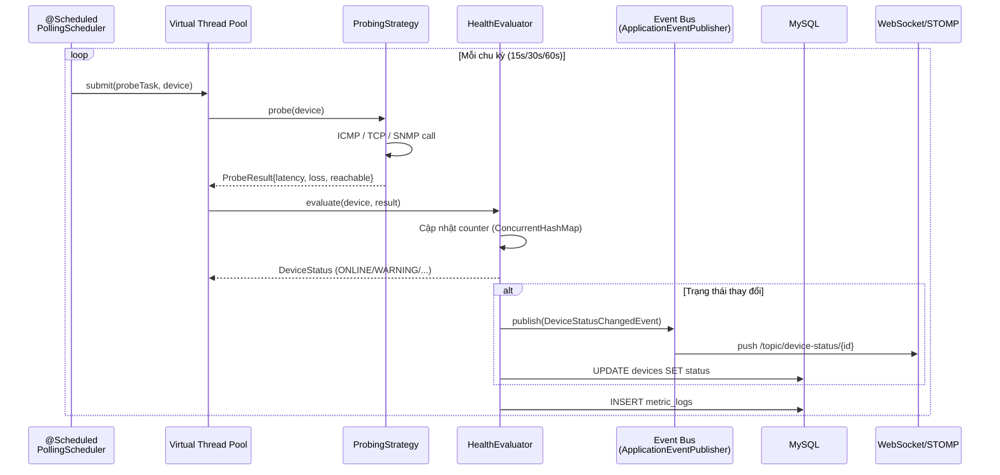

# QUY CHUẨN KIẾN TRÚC HỆ THỐNG — NETWORK DEVICE MANAGEMENT & MONITORING SYSTEM

> **Phiên bản:** 1.0.0  
> **Cập nhật:** 2026-09-16  
> **Phạm vi:** Kiến trúc tổng thể, phân lớp dữ liệu, quản lý trạng thái, quy chuẩn code (Java 25 · Spring Boot 3.5.x · MySQL 8.x)  
> **Vai trò:** Single Source of Truth về kiến trúc — bổ trợ `logic.md` (nghiệp vụ) và `techs.md` (công nghệ).

---

## MỤC LỤC

1. [Mô Hình Kiến Trúc Tổng Thể](#1-mô-hình-kiến-trúc-tổng-thể)
2. [Quy Tắc Phân Lớp & Luồng Dữ Liệu](#2-quy-tắc-phân-lớp--luồng-dữ-liệu)
3. [Quản Lý Trạng Thái](#3-quản-lý-trạng-thái)
4. [Danh Mục Công Nghệ & Thư Viện Được Phép](#4-danh-mục-công-nghệ--thư-viện-được-phép)
5. [Nguyên Tắc Thiết Kế & Quy Chuẩn Code](#5-nguyên-tắc-thiết-kế--quy-chuẩn-code)
6. [Phụ Lục](#6-phụ-lục)

---

## 1. Mô Hình Kiến Trúc Tổng Thể

### 1.1 Kiến Trúc Được Chọn

**Layered Architecture + Event-Driven** — Kiến trúc phân lớp kết hợp xử lý sự kiện bất đồng bộ.

- **Luồng HTTP (Web Application):** Xử lý request/response đồng bộ từ Client (REST API).
- **Luồng Nền (Worker/Polling Engine):** Xử lý bất đồng bộ các tác vụ thăm dò mạng (ICMP/TCP/SNMP) — hoàn toàn độc lập với luồng HTTP.
- **Kết nối giữa hai luồng qua Spring `ApplicationEventPublisher`** (Event Bus nội bộ) — khi Worker phát hiện sự cố, publish event để Web layer push real-time.

### 1.2 Phân Tách 2 Luồng Xử Lý Độc Lập

#### Luồng 1 — Worker / Polling Engine (Network I/O Nền)

| Đặc điểm | Chi tiết |
|---|---|
| **Vai trò** | Lập lịch quét định kỳ, gửi probe ICMP/TCP/SNMP tới thiết bị. |
| **Execution Model** | Java 25 **Virtual Threads** — `Executors.newVirtualThreadPerTaskExecutor()`. |
| **Kích hoạt** | `@Scheduled` + `@Async` (Spring AsyncConfig). |
| **Blocking I/O?** | Có — gọi `Socket.connect()`, `InetAddress.isReachable()`, `SnmpSession.get()` (blocking). Đây là I/O ngầm, KHÔNG chạy trên luồng web. |
| **Ghi DB** | Ghi `metric_logs`, `device_logs`, `alerts`. |
| **Publish Event** | Phát `DeviceStatusChangedEvent`, `AlertTriggeredEvent` qua `ApplicationEventPublisher`. |

#### Luồng 2 — Web Application (Tương Tác Client)

| Đặc điểm | Chi tiết |
|---|---|
| **Vai trò** | Tiếp nhận HTTP REST API, trả JSON, push WebSocket/STOMP. |
| **Execution Model** | Tomcat Thread Pool (HTTP request threads). |
| **Blocking I/O?** | **Nghiêm cấm** — không được probe mạng trong luồng này. |
| **Đọc DB** | Đọc `devices`, `metric_logs` (aggregated), `alerts` cho API/Dashboard. |
| **Lắng nghe Event** | `@EventListener` cập nhật cache in-memory và đẩy qua `/topic/*`. |

### 1.3 Sơ Đồ Kiến Trúc Tổng Thể

```mermaid
graph TB
    subgraph "Client Tier"
        BROWSER[Web Browser<br/>Dashboard UI]
        API_CLIENT[API Consumer]
    end

    subgraph "Presentation Layer"
        REST[REST Controller<br/>@RestController]
        WS[WebSocket/STOMP<br/>/ws]
        PUBLIC[Static Resources]
    end

    subgraph "Business Layer & Event Bus"
        SVC[Service Layer]
        EVENTBUS[Spring ApplicationEventPublisher<br/>Event Bus Nội Bộ]
        SCHED[@Scheduled<br/>Polling Scheduler]
        PROBE[Probing Strategies<br/>ICMP · TCP · SNMP]
        EVAL[Health Evaluator<br/>State Machine]
        ALERT[Alert Engine<br/>De-dup · Throttle]
        NOTIFY[Notification Dispatcher<br/>WebSocket]
    end

    subgraph "Persistence Layer"
        REPO[Spring Data JPA<br/>Repository Interfaces]
        ENTITY[Entities<br/>Device · Metric · Alert · User]
    end

    subgraph "Infrastructure"
        MYSQL[(MySQL 8.x)]
        CACHE[(In-Memory Cache<br/>Health Counters)]
    end

    BROWSER --> REST
    BROWSER --> WS
    API_CLIENT --> REST

    REST --> SVC
    REST ---> PUBLIC

    SVC --> ENTITY
    SVC --> EVENTBUS

    EVENTBUS --> |DeviceStatusChangedEvent| WS
    EVENTBUS --> |AlertTriggeredEvent| NOTIFY
    EVENTBUS --> |MetricCollectedEvent| EVAL

    SCHED --> PROBE
    PROBE --> |ProbeResult| EVAL
    EVAL --> |Status Change| EVENTBUS
    EVAL --> CACHE

    ALERT --> EVENTBUS

    NOTIFY --> WS

    REPO --> ENTITY
    ENTITY --> MYSQL
    SVC <--> REPO
    EVAL --> REPO
    ALERT --> REPO
```

#### 1.4 Sơ Đồ Luồng Xử Lý (Sequence — Polling Cycle)



---

## 2. Quy Tắc Phân Lớp & Luồng Dữ Liệu

### 2.1 Phân Tách Package (Package Convention)

```
com.network.network_monitor/
├── controller/     → HTTP REST API endpoints (@RestController)
├── service/        → Business logic (@Service) + impl/
├── repository/     → Spring Data JPA interfaces (@Repository)
├── entity/         → JPA @Entity classes
├── enums/          → Domain enums
├── dto/            → Request/Response DTOs (request|response)
├── event/          → Domain events + listener/
├── strategy/       → Probing strategy interfaces & implementations
├── scheduler/      → PollingScheduler, HealthEvaluator, AlertEngine
├── notification/   → NotificationDispatcher, WebSocket notifier
├── config/         → @Configuration classes (Async, Security, WebSocket)
├── exception/      → Custom exceptions + GlobalExceptionHandler
└── util/           → Validators, NetworkUtils
```

### 2.2 Nguyên Tắc Luồng Dữ Liệu 1 Chiều (Unidirectional Data Flow)

```
HTTP Request
    │
    ▼
┌──────────────┐   @Valid @RequestBody   
│  Controller  │ ─────────────────────►  DTO Request
│  (REST)      │                        (bean validation,
└──────┬───────┘                         @Pattern cho IP/MAC)
       │  Không logic nghiệp vụ
       │  Không query DB
       ▼
┌──────────────┐   Service method receives DTO
│  Service     │   • Validate business rules
│  (Business)  │   • Convert DTO ⇄ Entity (MapStruct / manual)
└──────┬───────┘   • Invoke strategy if needed
       │           • Publish domain events
       ▼
┌──────────────┐
│  Repository  │ ────────────────────►  Database
│  (JPA)       │
└──────────────┘
```

#### Quy Tắc Từng Lớp

| Lớp | Trách nhiệm | NGHIÊM CẤM |
|---|---|---|
| **Controller** | Tiếp nhận request, binding DTO, gọi Service, trả response. | Chứa logic nghiệp vụ. Truy vấn DB trực tiếp. Sử dụng Entity làm response body. |
| **Service** | Toàn bộ nghiệp vụ, giao dịch (`@Transactional`), convert DTO ⇄ Entity, phát domain events, orchestrate strategies. | Lộ Entity ra Controller. Logic HTTP/JSON. |
| **Repository** | Kế thừa `JpaRepository<T, ID>`, định nghĩa query method hoặc `@Query` SPEL. | Chứa business logic. |
| **Entity** | Map bảng DB, mô tả domain model. | Chứa logic tính toán phức tạp. Lộ ra Controller (trừ trường hợp đặc biệt có document). |
| **DTO** | Transport object: `CreateDeviceRequest`, `DeviceResponse`, `DashboardSummaryResponse`, `TimeSeriesPoint`. | Chứa annotation JPA. Chứa logic. |
| **Strategy** | Triển khai từng giải thuật probe (`probe(Device) → ProbeResult`). | Chạy trực tiếp trên luồng web. |
| **Event** | POJO thông tin sự kiện: `DeviceStatusChangedEvent(status, deviceId, timestamp, reason)`. | Chứa tham chiếu Entity/Repository. |

### 2.3 Chuẩn DTO Mapping

| Chiều | Quy tắc |
|---|---|
| **Inbound** (Request → Entity) | Validation bằng Bean Validation annotation: `@NotBlank`, `@Size`, `@Pattern(regexp = IP_REGEX)`. Sau đó Service convert manual hoặc MapStruct. |
| **Outbound** (Entity → Response) | Service convert, KHÔNG expose entity field `version`, `createdAt` nếu không cần. DTO response phải có timestamp ISO-8601 UTC. |
| **Naming** | Request: `CreateXxxRequest`, `UpdateXxxRequest`. Response: `XxxResponse`, `XxxSummaryResponse`. |

### 2.4 Service Interface & Implementation

```
Nguyên tắc: Service luôn định nghĩa Interface trước, Implementation bên dưới.
             Inject Interface vào Controller (Dependency Inversion).

DeviceService (interface)
├── create(CreateDeviceRequest) → DeviceResponse
├── update(Long id, UpdateDeviceRequest) → DeviceResponse
├── softDelete(Long id) → void
├── changeStatus(Long id, DeviceStatus status) → DeviceResponse
├── getById(Long id) → DeviceResponse
└── search(filter) → Page<DeviceResponse>
```

### 2.5 Repository Best Practices

| Yêu cầu | Chi tiết |
|---|---|
| **Kế thừa** | `JpaRepository<Entity, Long>` (không phải `CrudRepository`) để có sẵn `Pageable` support. |
| **Query method** | Sprint Data method name: `findByIpAddress(...)`, `existsByMacAddress(...)`, `findByStatus(...)`. |
| **Time-series** | Dùng `@Query` với `DATE_SUB(NOW(), INTERVAL n HOUR)` để lấy cửa sổ 1h/24h/7d trên cột `recorded_at`. |
| **Aggregation** | Dùng projection interface (`DashboardSummaryProjection`) thay vì native JSON thủ công. |
| **Index** | Đảm bảo index trên cột thường dùng `WHERE`: `(device_id, recorded_at)`, `(device_id, status)`. |

**Ví dụ repository query time-series:**

```java
public interface MetricLogRepository extends JpaRepository<MetricLog, Long> {

    @Query("""
        SELECT m FROM MetricLog m
        WHERE m.device.id = :deviceId
          AND m.timestamp >= :startTime
        ORDER BY m.timestamp ASC
        """)
    List<MetricLog> findTimeSeries(
        @Param("deviceId") Long deviceId,
        @Param("startTime") LocalDateTime startTime);
}
```

---

## 3. Quản Lý Trạng Thái

### 3.1 Phi Trạng Thái Cho Web/API (Stateless)

| Hạng mục | Quy tắc |
|---|---|
| **Xác thực** | JWT (JSON Web Token) — stateless, không lưu session server-side. |
| **Phân quyền** | Role-based qua `Spring Security` + `@PreAuthorize("hasRole('ADMIN')")`. |
| **Request context** | KHÔNG lưu state nội bộ Servlet. Mọi request tự đồng bộ. |
| **Lưu trữ phiên** | KHÔNG dùng `HttpSession`. |

### 3.2 Máy Trạng Thái Sức Khỏe Thiết Bị (Device Health State Machine)

```
                ┌──────────┐
                │ UNKNOWN  │  (mới tạo, chưa có data)
                └────┬─────┘
                     │ probe đầu tiên thành công
                     ▼
                ┌──────────┐  latency > warning hoặc loss ≥ warning   ┌───────────┐
        ┌──────►│  ONLINE  │ ─────────────────────────────────────────► │  WARNING  │
        │       └────┬─────┘                                            └─────┬─────┘
        │            │   ◄────────── latency/loss về mức bình thường ────────┘
        │            │
        │   success  │   fail ≥ N lần liên tiếp
        │   (≥ M lần)│
        │            ▼
        │       ┌───────────┐
        └───────│  OFFLINE  │
                └───────────┘
```

#### 3.2.1 Thuật Toán Chống Flapping (Chống Báo Động Giả)

**Cấu trúc In-Memory Counter:**

```java
public class HealthStateMonitor {
    // deviceId → số lần thất bại liên tiếp
    private final ConcurrentHashMap<Long, AtomicInteger> failCounters = new ConcurrentHashMap<>();

    // deviceId → số lần thành công liên tiếp
    private final ConcurrentHashMap<Long, AtomicInteger> successCounters = new ConcurrentHashMap<>();
}
```

**Quy tắc chuyển trạng thái:**

| Sự kiện | Counter | Điều kiện | Hành động |
|---|---|---|---|
| Probe thất bại | `failed++` | `failed == 1` | Ghi nhận, giữ nguyên trạng thái. |
| Probe thất bại | `failed++` | `failed < N (ví dụ 3)` | Ghi nhận, giữ nguyên. |
| Probe thất bại | `failed++` | `failed ≥ N (3)` | Chuyển sang `OFFLINE`. Reset success counter. **Phát `DeviceStatusChangedEvent`.** |
| Probe thành công | `success++` | `success < M (ví dụ 2)` | Ghi nhận, giữ nguyên (tránh recovery vội). |
| Probe thành công | `success++` | `success ≥ M (2)` | Chuyển về `ONLINE`. Reset fail counter. **Phát recovery event.** |
| DB init / restart | — | — | Reset tất cả counter về `0`, trạng thái `UNKNOWN`. |

**Pseudo-code:**

```
FUNCTION evaluate(deviceId, probeResult):
    config = getThreshold(deviceId)

    IF probeResult.reachable == FALSE:
        fail = failCounters.merge(deviceId, 1, Integer::sum)
        successCounters.remove(deviceId)        // reset success
        IF fail >= config.consecutiveFailures:
            changeStatus(deviceId, OFFLINE)
            publish(DeviceStatusChangedEvent)
        RETURN

    // reachable == TRUE
    success = successCounters.merge(deviceId, 1, Integer::sum)
    failCounters.remove(deviceId)               // reset fail

    currentStatus = getStatus(deviceId)

    // Nếu đang OFFLINE → cần M lần success liên tiếp
    IF currentStatus == OFFLINE:
        IF success >= config.consecutiveSuccess:
            changeStatus(deviceId, ONLINE)
            publish(DeviceStatusChangedEvent)
        RETURN

    // Đánh giá mức độ (latency / loss)
    status = classify(probeResult.latencyMs, probeResult.lossPct)
    IF status != currentStatus:
        changeStatus(deviceId, status)
        publish(DeviceStatusChangedEvent)
```

#### 3.2.2 Sự Kiện Chuyển Trạng Thái (Event Design)

```java
public record DeviceStatusChangedEvent(
    Long deviceId,
    DeviceStatus oldStatus,
    DeviceStatus newStatus,
    String reason,        // "consecutive_failure", "latency_high", "maintenance_on", ...
    LocalDateTime triggeredAt
) {}
```

**Listener (trong Web layer):**

```java
@EventListener(DeviceStatusChangedEvent.class)
public void onStatusChanged(DeviceStatusChangedEvent event) {
    websocketNotifier.pushDeviceStatus(event);  // /topic/device-status/{deviceId}
    if (event.newStatus() == DeviceStatus.OFFLINE) {
        alertEngine.evaluate(event);             // tạo alert + de-dup
    }
}
```

### 3.3 Chế Độ Bảo Trì (MAINTENANCE)

| Hạng mục | Quy tắc |
|---|---|
| **Thăm dò** | Có thể tiếp tục probe (để hiển thị dữ liệu) HOẶC dừng probe tùy cấu hình. |
| **Cảnh báo** | **VÔ HIỆU HÓA 100%** — không tạo `Alert`, không tạo thông báo hay spam WebSocket. |
| **Hiển thị** | Dashboard hiển thị badge `🛠 Maintenance`. |
| **Counter** | Reset failCounters khi vào/ra maintenance (tránh alert "sau" khi ra). |
| **Trạng thái** | DeviceStatus là enum gộp — giá trị `MAINTENANCE` (asset-level) nằm cùng enum với `ONLINE/WARNING/OFFLINE/UNKNOWN` (health-level). Khi `DeviceStatus == MAINTENANCE`, không được chuyển sang `OFFLINE`. Soft delete (`is_deleted = true`) đóng vai trò tương đương `DECOMMISSIONED`. |

---

## 4. Danh Mục Công Nghệ & Thư Viện Được Phép

> Tham chiếu đầy đủ phiên bản cụ thể tại `techs.md`.

### 4.1 Core Platform

| Công nghệ | Phiên bản | Mục đích | Trạng thái |
|---|---|---|---|
| Java | **25** | Ngôn ngữ lập trình chính, Virtual Threads. | ✅ Có |
| Spring Boot Starter Web | **3.5.16** | REST API, embedded Tomcat, Jackson. | ✅ Có |
| Spring Boot Starter Data JPA | **3.5.16** | ORM, Spring Data repositories. | ✅ Có |
| Spring Boot Starter Validation | **3.5.16** | Bean Validation (`@Valid`, `@Pattern`, custom). | ✅ Có |
| Maven | **3.9.16** | Build tool + Wrapper. | ✅ Có |

### 4.2 Giao Tiếp Mạng & Thăm Dò

| Công nghệ | Phiên bản | Mục đích | Trạng thái |
|---|---|---|---|
| `java.net.InetAddress` | JDK | ICMP Ping (isReachable). | ✅ Có |
| `java.net.Socket` | JDK | TCP Port Check. | ✅ Có |
| `org.snmp4j:snmp4j` | 3.8.x | SNMP v2c/v3 GetRequest. | ⬜ Cần thêm |
| `commons-net` | 3.11.x | Utility mạng bổ sung (FTP, Daytime, TFTP — không bắt buộc). | ⬜ Tùy chọn |

> **Lưu ý:** Ưu tiên JDK standard `java.net.*` cho ICMP/TCP. Chỉ dùng `commons-net` nếu cần protocol phức tạp hơn.

### 4.3 Cơ Sở Dữ Liệu & Xử Lý Đa Luồng

| Công nghệ | Phiên bản | Mục đích | Trạng thái |
|---|---|---|---|
| MySQL Server | **8.0+** | Database chính thức (InnoDB, utf8mb4). | ✅ Có |
| HikariCP | 6.3.3 | Connection pool (mặc định Spring Boot). | ✅ Có |
| Virtual Threads | Java 25 | `Executors.newVirtualThreadPerTaskExecutor()` — polling SSE. | ✅ Có |
| H2 Database | 2.3.232 | In-memory DB cho integration test. | ✅ Có (test) |

### 4.4 Thời Gian Thực & Cảnh Báo

| Công nghệ | Phiên bản | Mục đích | Trạng thái |
|---|---|---|---|
| Spring WebSocket (STOMP) | 3.5.16 | Push real-time `/topic/device-status/{id}`, `/topic/alerts`. | ⬜ Cần thêm |
| Spring `ApplicationEventPublisher` | 3.5.16 | Event Bus nội bộ giữa Worker ⇄ Web layer. | ✅ Có |

### 4.5 Dev & Testing Tools

| Công nghệ | Phiên bản | Mục đích | Trạng thái |
|---|---|---|---|
| Lombok | 1.18.x | Giảm boilerplate (getter/setter/builder). | ⬜ Cần thêm |
| JUnit 5 (Jupiter) | 5.12.2 | Unit/Integration testing. | ✅ Có |
| Mockito | 5.x | Mock dependencies trong unit test. | ✅ Có |
| AssertJ | 3.x | Fluent assertions. | ✅ Có |
| MockMvc | — | Controller layer testing. | ✅ Có |

### 4.6 Giả Lập Môi Trường Mạng (Testing Networks)

| Công cụ | Mục đích |
|---|---|
| **Docker** | Chạy MySQL/MySQL-testbed containers cục bộ và CI. |
| **GNS3** | Giả lập thiết bị Cisco/Juniper với SNMP agent — test SNMP Strategy end-to-end. |
| **Cisco Packet Tracer** | Mô phỏng topology mạng cơ bản cho manual testing. |

### 4.7 Bảng Quyết Định "ĐƯỢC PHÉP / KHÔNG ĐƯỢC PHÉP"

| Công nghệ | Quyết định | Lý do |
|---|---|---|
| Spring Boot 4.x | 🚫 Chưa dùng | Hiện tại giữ 3.5.16 (final 3.x). Nâng cấp khi ecosystem sẵn sàng. |
| Spring Reactive (WebFlux) | 🚫 Chưa dùng | Dùng Virtual Threads đã đủ non-blocking cho mô hình hiện tại. |
| MongoDB | 🚫 | Time-series metric có thể cân nhắc sau, hiện tại MySQL + rollup đủ. |
| Redis | 🟡 Tùy chọn | Cache dashboard aggregation (TTL) nếu cần scale. |
| Kafka/RabbitMQ | 🟡 Tùy chọn | Event bus ngoài tiến trình — chỉ khi multi-instance cần. Mặc định dùng Spring Event nội bộ. |
| Thymeleaf (server-side rendering) | 🟡 Email template only | KHÔNG dùng cho trang web — dùng API JSON + SPA. |

---

## 5. Nguyên Tắc Thiết Kế & Quy Chuẩn Code

### 5.1 SOLID Principles

| Nguyên tắc | Ứng dụng trong dự án |
|---|---|
| **S**ingle Responsibility | Service class chỉ làm 1 việc. `DeviceService` không gọi SNMP trực tiếp — giao cho `SnmpStrategy`. |
| **O**pen-Closed | Thêm probing strategy mới bằng implement `ProbingStrategy` — không sửa code cũ. |
| **L**iskov Substitution | Mọi strategy thay thế được nhau, cùng hợp đồng `probe(Device) → ProbeResult`. |
| **I**nterface Segregation | Tách `DeviceManagementService` / `DeviceMonitoringService` thay vì 1 interface khổng lồ. |
| **D**ependency Inversion | Controller phụ thuộc interface `DeviceService`, không phụ thuộc class cụ thể `DeviceServiceImpl`. Dùng `@Autowired` theo interface. Inject bằng constructor (KHÔNG field injection). |

### 5.2 Cơ Chế Xử Lý Ngoại Lệ Tập Trung

#### 5.2.1 Cấu Trúc Response Lỗi Chuẩn

```json
{
  "timestamp": "2026-09-16T10:30:00Z",
  "status": 409,
  "error_code": "ERR_DUPLICATE_IP",
  "message": "IP address 192.168.1.10 already exists",
  "path": "/api/devices",
  "details": { }
}
```

#### 5.2.2 `@RestControllerAdvice` — GlobalExceptionHandler

```java
@RestControllerAdvice
public class GlobalExceptionHandler {

    @ExceptionHandler(DuplicateIpException.class)
    public ResponseEntity<ApiError> handleDuplicateIp(DuplicateIpException ex) {
        return buildError(ex, 409, ex.getErrorCode(), ex.getMessage());
    }

    @ExceptionHandler(ConstraintViolationException.class)
    public ResponseEntity<ApiError> handleValidation(ConstraintViolationException ex) {
        return buildError(ex, 400, "ERR_VALIDATION_FAILED", ex.getMessage());
    }

    @ExceptionHandler(DeviceTimeoutException.class)
    public ResponseEntity<ApiError> handleTimeout(DeviceTimeoutException ex) {
        return buildError(ex, 504, "ERR_DEVICE_TIMEOUT", ex.getMessage());
    }

    @ExceptionHandler(Exception.class)  // fallback
    public ResponseEntity<ApiError> handleGeneric(Exception ex) {
        return buildError(ex, 500, "ERR_INTERNAL", "Internal server error");
    }
}
```

#### 5.2.3 Quy Tắc Ngoại Lệ

| Quy tắc | Chi tiết |
|---|---|
| Custom exception → code error | Mỗi business exception phải extends `BusinessException` với field `errorCode` (ex: `ERR_DUPLICATE_IP`). |
| Cause chain | Exception wrap phải `new DuplicateIpException(msg, ip, cause)`. |
| Log ở 1 nơi | Log lỗi trong `GlobalExceptionHandler` (với `ex.getStackTrace()`), không log lặt vặt ở service. |
| KHÔNG trả stacktrace | Response chỉ chứa `error_code` + `message` — không leak internal info. |

### 5.3 Nguyên Tắc Non-Blocking I/O

```
QUY TẮC CỨNG:
┌────────────────────────────────────────────────────────────────────┐
│  NGHIÊM CẤM chạy network probe (ICMP/TCP/SNMP)                    │
│  trong luồng HTTP request (Controller thread).                    │
│                                                                    │
│  ✓ Bắt buộc: mọi tác vụ thăm dò mạng phải submit vào              │
│    virtual-thread-per-task executor (background worker).          │
│                                                                    │
│  ✓ API "probeNow/refresh" (nếu có) phải trả về 202 Accepted       │
│    + jobId, KHÔNG block request đợi kết quả probe.                │
│                                                                    │
│  ✓ WebSocket push thay cho client polling.                        │
└────────────────────────────────────────────────────────────────────┘
```

**Context nếu cần probe đồng bộ:**

```
Nếu business yêu cầu kiểm tra trạng thái tức thì:
  1. Đọc status + counter hiện tại (in-memory / DB).
  2. Trả về value MỚI NHẤT đã có — KHÔNG trigger probe mới.
  3. Dữ liệu probe luôn là eventual consistency (tối đa 1 chu kỳ poll).
  4. Nếu thật sự cần probe sync (rare), dùng CompletableFuture with timeout —
     but vẫn phải executed trên worker, only THE result is awaited (có giới hạn).
```

### 5.4 Quy Chuẩn Code Convention

| Hạng mục | Quy tắc |
|---|---|
| **Constructor Injection** | Bắt buộc dùng `@RequiredArgsConstructor` (Lombok) hoặc viết constructor — KHÔNG field `@Autowired`. |
| **Transaction** | `@Transactional` trên Service method, không trên Controller. Read-only: `@Transactional(readOnly = true)`. |
| **NULL handling** | Dùng `Optional<T>` trong Service return. Hạn chế trả `null`. |
| **Date/Time** | Dùng `LocalDateTime` + UTC. KHÔNG dùng `java.util.Date` / `Calendar`. |
| **Immutability** | Entity `@Setter` 필드 tối thiểu. DTO request gần như immutable. |
| **Naming** | `findXxx()` cho query, `create/update/delete` cho mutation. KHÔNG dùng `getXxx()` cho DB. |
| **Logging** | SLF4J — `LoggerFactory.getLogger(X.class)`. KHÔNG System.out. |
| **Magic number** | Mọi threshold/cooldown phải là constant hoặc config, không hardcode. |
| **Record** | DTO/Event dùng Java `record` khi immutable. |
| **Streams** | Dùng stream API cho collections, hạn chế for-loop lồng nhau. |

### 5.5 Dependency Injection Matrix

```
Controller ──► Interface Service
                │
                ├──► Interface ProbingStrategy
                │        ├── PingStrategy (impl)
                │        ├── TcpPortStrategy (impl)
                │        └── SnmpStrategy (impl)
                │
                ├──► Repository (JpaRepository)
                │
                └──► ApplicationEventPublisher (Spring built-in)
```

```java
@RestController
@RequestMapping("/api/devices")
@RequiredArgsConstructor
public class DeviceController {

    private final DeviceService deviceService;      // interface, không phải impl

    @PostMapping
    public ResponseEntity<DeviceResponse> create(
        @Valid @RequestBody CreateDeviceRequest request) {
        return ResponseEntity.status(HttpStatus.CREATED)
            .body(deviceService.create(request));
    }
}
```

---

## 6. Phụ Lục

### 6.1 Topology Môi Trường Dev

```
┌──────────────────────────┐      ┌──────────────────────────┐
│     Dev Machine          │      │  Simulated Network       │
│                          │      │                          │
│  NDMMS Backend (8080)    │      │  MySQL 8.x Container     │
│  Virtual Threads +       │─────►│  (Docker, port 3306)     │
│  Scheduled Polling       │      │                          │
│                          │      │  GNS3 / Packet Tracer    │
│  Web Dashboard Dev (5173)│      │  Router · Switch · AP    │
│  (Vite + React)          │      │  with SNMP agent         │
└──────────────────────────┘      └──────────────────────────┘
```

### 6.2 Cấu Hình Async (Spring Config)

```java
@Configuration
@EnableAsync
@EnableScheduling
public class AsyncConfig {

    @Bean("pollingExecutor")
    public Executor pollingExecutor() {
        return Executors.newVirtualThreadPerTaskExecutor();
    }

    @Bean
    public ApplicationEventPublisher eventPublisher(ApplicationContext ctx) {
        return ctx;  // Autowire thay vì tạo mới
    }
}
```

### 6.3 Cấu Hình Properties (Tóm Tắt)

```properties
# Async / Scheduling
spring.task.scheduling.pool.size=4
spring.task.execution.thread-name-prefix=vt-poll-

# Open-in-view OFF (bắt buộc)
spring.jpa.open-in-view=false

# Validation
jakarta.validation... (bean validation auto)

# WebSocket
spring.websocket.endpoint=/ws
```

### 6.4 Checklist Review Kiến Trúc

| # | Mục cần kiểm tra | Trạng thái |
|---|---|---|
| 1 | Controller không chứa business logic, không query DB trực tiếp | ☐ |
| 2 | Service inject interface, constructor injection, không field `@Autowired` | ☐ |
| 3 | Network probe thuộc Worker thread, không block HTTP thread | ☐ |
| 4 | DTO/Entity tách biệt, Entity không lộ ra Controller | ☐ |
| 5 | Status transition đúng state machine, có chống flapping | ☐ |
| 6 | Maintenance mode vô hiệu hóa alert 100% | ☐ |
| 7 | GlobalExceptionHandler xử lý mọi exception, response chuẩn format | ☐ |
| 8 | Không hardcode threshold — dùng config / constant | ☐ |
| 9 | `open-in-view=false`, transaction đặt đúng Service | ☐ |
| 10 | Time-series query có index hỗ trợ | ☐ |
| 11 | Event-driven: status change phát qua EventBus + WebSocket push | ☐ |
| 12 | Tuân thủ `rules/logic.md`, `rules/techs.md`, `rules/system_design.md` | ☐ |

---

### 6.5 Thứ Tự Ưu Tiên Tài Liệu (Conflict Resolution)

```
Nếu có mâu thuẫn giữa các tài liệu quy chuẩn:

1. rules/logic.md          → Quy chuẩn NGHIỆP VỤ (ưu tiên số 1)
2. rules/system_design.md  → Quy chuẩn KIẾN TRÚC & CODE (ưu tiên số 2)
3. rules/techs.md          → Danh mục CÔNG NGHỆ được phép (ưu tiên số 3)

Code luôn phải được sửa để tuân thủ tài liệu — không sửa tài liệu để hợp code.
```

---

> **Kết luận:** Tài liệu này là khung chuẩn kiến trúc. Mọi PR phải vượt qua checklist §6.4 trước khi merge. Mọi quyết định kiến trúc tương lai phải được ghi chú tại đây.