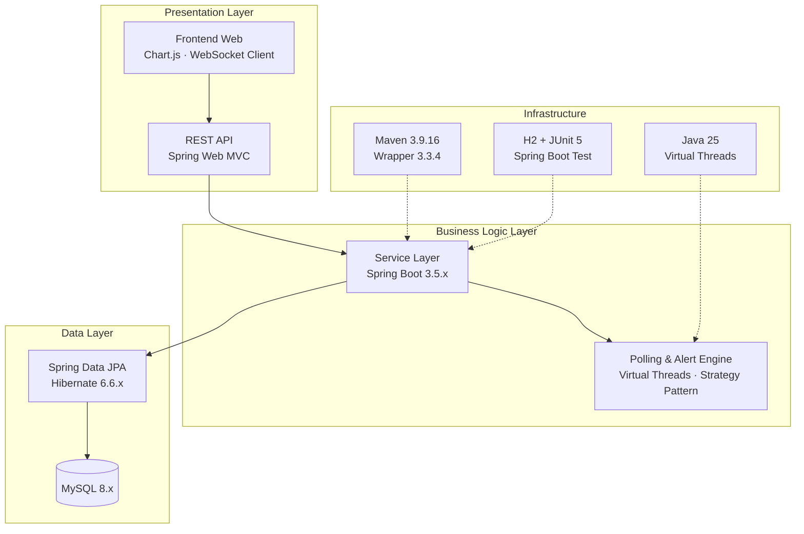

# TECHNOLOGY STACK — NETWORK DEVICE MANAGEMENT & MONITORING SYSTEM

> **Phiên bản:** 1.0.0  
> **Cập nhật:** 2026-09-16  
> **Vai trò:** Danh mục chuẩn các công nghệ, framework, thư viện áp dụng trong dự án. Mọi quyết định tech stack phải tham chiếu tài liệu này.

---

## MỤC LỤC

1. [Tổng Quan Stack](#1-tổng-quan-stack)
2. [Ngôn Ngữ & Nền Tảng](#2-ngôn-ngữ--nền-tảng)
3. [Backend Framework](#3-backend-framework)
4. [Cơ Sở Dữ Liệu & ORM](#4-cơ-sở-dữ-liệu--orm)
5. [Mạng & Giao Thức Thăm Dò](#5-mạng--giao-thức-thăm-dò)
6. [Thông Báo & Thời Gian Thực](#6-thông-báo--thời-gian-thực)
7. [Bảo Mật & Xác Thực](#7-bảo-mật--xác-thực)
8. [Kiểm Thử & Đánh Giá Chất Lượng](#8-kiểm-thử--đánh-giá-chất-lượng)
9. [Build Tool & DevOps](#9-build-tool--devops)
10. [Frontend (Dự Kiến)](#10-frontend-dự-kiến)
11. [Bảng Phiên Bản & Tương Thích](#11-bảng-phiên-bản--tương-thích)
12. [Dependency Chưa Có Cần Bổ Sung](#12-dependency-chưa-có-cần-bổ-sung)

---

## 1. Tổng Quan Stack



---

## 2. Ngôn Ngữ & Nền Tảng

| Hạng mục            | Phiên bản                          | Ghi chú                                                                                              |
| ------------------- | ---------------------------------- | ---------------------------------------------------------------------------------------------------- |
| **Java**            | **25** (Early Access / GA)         | Ngôn ngữ chính của backend.                                                                          |
| **JVM**             | HotSpot JDK 25                     | Oracle JDK hoặc OpenJDK distribution.                                                                |
| **Virtual Threads** | **Bật mặc định** (JEP 444 — Final) | Sử dụng `Executors.newVirtualThreadPerTaskExecutor()` cho I/O-bound tasks (ICMP, TCP, SNMP polling). |

### Tại Sao Java 25?

| Feature                              | Lợi ích cho dự án                                                                                             |
| ------------------------------------ | ------------------------------------------------------------------------------------------------------------- |
| **Virtual Threads (JEP 444)**        | Thousands of concurrent polling threads without OS thread overhead. Chống nghẽn I/O cho ICMP/TCP/SNMP probes. |
| **Structured Concurrency (Preview)** | Quản lý luồng polling theo group, dễ hủy/handle exception tập trung.                                          |
| **Scoped Values (Preview)**          | Truyền context (device ID, config) qua virtual thread mà không cần `ThreadLocal`.                             |
| **Pattern Matching (finalized)**     | Code gọn hơn khi xử lý `ProbeResult`, `AlertType` enum.                                                       |
| **ZGC Generational (Production)**    | Low-latency GC, phù hợp thời gian thực.                                                                       |

---

## 3. Backend Framework

### 3.1 Spring Boot

| Hạng mục                       | Phiên bản         | Artifact                     |
| ------------------------------ | ----------------- | ---------------------------- |
| **Spring Boot Starter Parent** | **3.5.16**        | `spring-boot-starter-parent` |
| **Spring Framework**           | 6.2.19            | (đi kèm Spring Boot 3.5.16)  |
| **Hibernate ORM**              | 6.6.53.Final      | (đi kèm Spring Boot 3.5.16)  |
| **Apache Tomcat**              | 10.1.x (Embedded) | Web server mặc định          |

> **Lưu ý:** Spring Boot 3.5.x là bản 3.x cuối cùng (OSS EOL: 30/06/2026). Dự án đang dùng bản final patch. Nếu cần nâng cấp, tuyến tiếp theo là Spring Boot 4.0.x (Spring Framework 7.x).

### 3.2 Spring Boot Starters Đang Sử Dụng

| Starter                          | Scope   | Mục đích                                                               |
| -------------------------------- | ------- | ---------------------------------------------------------------------- |
| `spring-boot-starter-web`        | compile | REST API, embedded Tomcat, Jackson JSON.                               |
| `spring-boot-starter-data-jpa`   | compile | JPA/Hibernate, Spring Data repositories.                               |
| `spring-boot-starter-validation` | compile | Bean Validation (Jakarta) — `@NotNull`, `@Pattern`, custom validators. |
| `spring-boot-starter-test`       | test    | JUnit 5, Mockito, Spring Test, AssertJ.                                |

---

## 4. Cơ Sở Dữ Liệu & ORM

### 4.1 MySQL

| Hạng mục              | Giá trị                                            |
| --------------------- | -------------------------------------------------- |
| **Database**          | MySQL 8.x (InnoDB)                                 |
| **JDBC Driver**       | `mysql-connector-j` 9.7.0 (managed by Spring Boot) |
| **Connector groupId** | `com.mysql`                                        |
| **Charset**           | `utf8mb4` (hỗ trợ emoji + Unicode)                 |
| **Timezone**          | `UTC` (cấu hình trong JDBC URL)                    |
| **Connection Pool**   | HikariCP (mặc định Spring Boot)                    |

### 4.2 JDBC URL Format

```
jdbc:mysql://localhost:3306/network_monitor?useSSL=false&allowPublicKeyRetrieval=true&serverTimezone=UTC
```

### 4.3 Hibernate / JPA Config

| Property                                     | Giá trị    | Ý nghĩa                                                                                |
| -------------------------------------------- | ---------- | -------------------------------------------------------------------------------------- |
| `spring.jpa.hibernate.ddl-auto`              | `validate` | **Chỉ kiểm tra** schema, KHÔNG tự tạo/sửa table. Schema quản lý bằng migration script. |
| `spring.jpa.open-in-view`                    | `false`    | Tắt Open Session In View anti-pattern.                                                 |
| `spring.jpa.show-sql`                        | `false`    | Không log SQL query ở production.                                                      |
| `spring.jpa.properties.hibernate.format_sql` | `true`     | Format SQL đẹp khi debug.                                                              |

### 4.4 Schema Migration (Khuyến Nghị)

| Công cụ       | Phiên bản | Trạng thái                                                    |
| ------------- | --------- | ------------------------------------------------------------- |
| **Flyway**    | 10.x      | **KHUYẾN NGHỊ** thêm — quản lý migration script theo version. |
| **Liquibase** | 4.x       | Alternative thay thế Flyway.                                  |

> Hiện tại dự án dùng `ddl-auto=validate` nên cần duy trì DDL script thủ công hoặc bổ sung Flyway/Liquibase.

### 4.5 H2 Database (Test Only)

| Hạng mục     | Giá trị                                |
| ------------ | -------------------------------------- |
| **Artifact** | `com.h2database:h2`                    |
| **Scope**    | `test`                                 |
| **Mode**     | `MODE=MYSQL` (tương thích syntax)      |
| **URL**      | `jdbc:h2:mem:testdb;DB_CLOSE_DELAY=-1` |

---

## 5. Mạng & Giao Thức Thăm Dò

### 5.1 ICMP Ping

| Hạng mục             | Chi tiết                                                                             |
| -------------------- | ------------------------------------------------------------------------------------ |
| **Phương thức**      | `java.net.InetAddress.isReachable(timeout)`                                          |
| **Fallback**         | `Runtime.getRuntime().exec("ping -n 3 <ip>")` (Windows) / `"ping -c 3 <ip>"` (Linux) |
| **Đo lường**         | Round-Trip Time (ms), Packet Loss (%)                                                |
| **Timeout mặc định** | 3000ms                                                                               |
| **Library**          | JDK standard (`java.net.*`) — không cần thêm dependency.                             |

### 5.2 TCP Port Check

| Hạng mục             | Chi tiết                                                                |
| -------------------- | ----------------------------------------------------------------------- |
| **Phương thức**      | `java.net.Socket.connect(InetSocketAddress, timeout)`                   |
| **Port kiểm tra**    | 80 (HTTP), 443 (HTTPS), 22 (SSH), 3306 (MySQL) — cấu hình theo thiết bị |
| **Timeout mặc định** | 2000ms                                                                  |
| **Library**          | JDK standard (`java.net.*`) — không cần thêm dependency.                |

### 5.3 SNMP (CẦN BỔ SUNG)

| Hạng mục           | Chi tiết                                                      |
| ------------------ | ------------------------------------------------------------- |
| **Library**        | **SNMP4J 3.x** (`org.snmp4j:snmp4j`)                          |
| **Phiên bản SNMP** | SNMPv2c (Community String) / SNMPv3 (USM — Auth + Priv)       |
| **Mục đích**       | Thu thập CPU, RAM, Bandwidth, System Uptime từ thiết bị       |
| **OID tham chiếu** | CPU: `1.3.6.1.4.1.2021.11.9.0`, RAM: `1.3.6.1.4.1.2021.4.6.0` |

> **Trạng thái:** Chưa có trong `pom.xml`. Cần thêm dependency khi implement SNMP Strategy.

---

## 6. Thông Báo & Thời Gian Thực

### 6.1 WebSocket / STOMP (CẦN BỔ SUNG)

| Hạng mục     | Chi tiết                                                         |
| ------------ | ---------------------------------------------------------------- |
| **Starter**  | `spring-boot-starter-websocket`                                  |
| **Protocol** | STOMP over WebSocket                                             |
| **Endpoint** | `/ws`                                                            |
| **Topics**   | `/topic/device-status/{id}`, `/topic/alerts`, `/topic/dashboard` |
| **Mục đích** | Push real-time status change, alert events lên Dashboard.        |

### 6.2 Phương Thức Thông Báo

| Kênh      | Severity | Real-time | Lưu log             | Dependency cần thêm             |
| --------- | -------- | --------- | ------------------- | ------------------------------- |
| WebSocket | Mọi mức  | <100ms    | `notification_logs` | `spring-boot-starter-websocket` |

> *Ghi chú:* Đã loại bỏ kênh thông báo Telegram Bot và Email/SMTP theo yêu cầu kiến trúc, chỉ duy trì thông báo thời gian thực qua WebSocket và ghi nhận nhật ký hệ thống.

---

## 7. Bảo Mật & Xác Thực

### 7.1 Spring Security (CẦN BỔ SUNG)

| Hạng mục             | Chi tiết                                  |
| -------------------- | ----------------------------------------- |
| **Starter**          | `spring-boot-starter-security`            |
| **Phiên bản**        | 6.4.x (managed by Spring Boot 3.5.16)     |
| **Xác thực**         | JWT (JSON Web Token) cho REST API         |
| **Phân quyền**       | Role-based: `ADMIN`, `OPERATOR`, `VIEWER` |
| **Password Encoder** | `BCryptPasswordEncoder`                   |

### 7.2 Ma Trận Phân Quyền

| Hành động                   | ADMIN | OPERATOR       | VIEWER         |
| --------------------------- | ----- | -------------- | -------------- |
| CRUD thiết bị               | ✅    | ✅ (không xóa) | ❌             |
| Cập nhật MonitoringConfig   | ✅    | ✅             | ❌             |
| Acknowledge / Resolve Alert | ✅    | ✅             | ❌             |
| Chế độ Maintenance          | ✅    | ✅             | ❌             |
| Xem Dashboard               | ✅    | ✅             | ✅             |
| Quản lý User / Role         | ✅    | ❌             | ❌             |
| Xem Logs & Reports          | ✅    | ✅             | ✅ (read-only) |

---

## 8. Kiểm Thử & Đánh Giá Chất Lượng

### 8.1 Testing Stack

| Hạng mục              | Phiên bản                              | Scope  |
| --------------------- | -------------------------------------- | ------ |
| **JUnit 5 (Jupiter)** | 5.12.2                                 | `test` |
| **Spring Boot Test**  | 3.5.16                                 | `test` |
| **Mockito**           | 5.x (managed)                          | `test` |
| **AssertJ**           | 3.x (managed)                          | `test` |
| **H2 Database**       | 2.3.232                                | `test` |
| **MockMvc**           | (included in spring-boot-starter-test) | `test` |

### 8.2 Loại Test Cần Implement

| Loại                 | Phạm vi                    | Công cụ                      | Mục tiêu                           |
| -------------------- | -------------------------- | ---------------------------- | ---------------------------------- |
| **Unit Test**        | Service, Engine, Validator | JUnit 5 + Mockito            | Test logic thuần túy, mock DB.     |
| **Integration Test** | Repository, API endpoint   | Spring Boot Test + H2        | Test interaction với DB in-memory. |
| **Slice Test**       | Controller                 | `@WebMvcTest` + MockMvc      | Test HTTP request/response.        |
| **Contract Test**    | API response format        | Spring RestDocs hoặc AssertJ | Đảm bảo response JSON đúng schema. |

### 8.3 Code Quality Tools (Khuyến Nghị)

| Công cụ            | Mục đích                           | Trạng thái       |
| ------------------ | ---------------------------------- | ---------------- |
| **Checkstyle**     | Kiểm tra code style convention     | Khuyến nghị thêm |
| **SpotBugs / PMD** | Static analysis — tìm bug tiềm ẩn  | Khuyến nghị thêm |
| **JaCoCo**         | Code coverage report               | Khuyến nghị thêm |
| **SonarQube**      | Dashboard tổng hợp chất lượng code | Tùy chọn         |

---

## 9. Frontend (Dự Kiến)

> **Lưu ý:** Frontend hiện chưa implement trong repo. Đây là planning cho phase tiếp theo.

---

## 10. Bảng Phiên Bản & Tương Thích

### 10.1 Matrix Phiên Bản Official

| Component          | Phiên bản hiện tại | Phiên bản mới nhất (tháng 9/2026) | Trạng thái                |
| ------------------ | ------------------ | --------------------------------- | ------------------------- |
| Java               | **25**             | 25                                | ✅ Latest                 |
| Spring Boot        | **3.5.16**         | 4.1.1                             | ⚠️ 3.5.x EOL (30/06/2026) |
| Spring Framework   | **6.2.19**         | 7.1.x                             | ⚠️ EOL theo SB 3.5        |
| Hibernate ORM      | **6.6.53.Final**   | 7.4.x                             | ⚠️ Latest 6.x             |
| MySQL              | **8.x**            | 8.0 / 9.x                         | ✅ Supported              |
| MySQL Connector/J  | **9.7.0**          | 9.7.0                             | ✅ Latest                 |
| HikariCP           | **6.3.3**          | 6.3.3                             | ✅ Latest                 |
| Maven              | **3.9.16**         | 3.9.16                            | ✅ Latest                 |
| Maven Wrapper      | **3.3.4**          | 3.3.4                             | ✅ Latest                 |
| H2 Database (test) | **2.3.232**        | 2.3.232                           | ✅ Latest                 |
| JUnit 5            | **5.12.2**         | 5.12.x                            | ✅ Latest                 |

### 10.2 Tương Thích Version

```
Java 25 ──────┐
               ├──→ Spring Boot 3.5.x ✅
Spring 6.2.x ─┘

Java 25 ──────┐
               ├──→ Spring Boot 4.0.x ✅ (nâng cấp tương lai)
Spring 7.x ───┘

Hibernate 6.6.x → Tương thích Spring Boot 3.5.x ✅
Hibernate 7.x   → Yêu cầu Spring Boot 4.0.x
```

---

## 11. Dependency Chưa Có Cần Bổ Sung

Bảng tổng hợp các dependency **cần thêm vào `pom.xml`** trong các phase tiếp theo:

| #   | Artifact                        | GroupId                    | Version | Scope   | Phase   | Mục đích                        |
| --- | ------------------------------- | -------------------------- | ------- | ------- | ------- | ------------------------------- |
| 1   | `snmp4j`                        | `org.snmp4j`               | 3.8.x   | compile | Phase 2 | SNMP polling strategy           |
| 2   | `spring-boot-starter-websocket` | `org.springframework.boot` | 3.5.16  | compile | Phase 2 | WebSocket/STOMP real-time       |
| 3   | `spring-boot-starter-security`  | `org.springframework.boot` | 3.5.16  | compile | Phase 2 | Authentication + Authorization  |
| 4   | `jjwt-api`                      | `io.jsonwebtoken`          | 0.12.x  | compile | Phase 2 | JWT token generation/validation |
| 5   | `jjwt-impl`                     | `io.jsonwebtoken`          | 0.12.x  | runtime | Phase 2 | JWT implementation              |
| 6   | `jjwt-jackson`                  | `io.jsonwebtoken`          | 0.12.x  | runtime | Phase 2 | JWT JSON serialization          |
| 7   | `flyway-core`                   | `org.flywaydb`             | 10.x    | compile | Phase 2 | Database migration              |
| 8   | `flyway-mysql`                  | `org.flywaydb`             | 10.x    | compile | Phase 2 | Flyway MySQL dialect            |

---

> **Quy tắc:** Mọi dependency mới phải được review và thêm vào tài liệu này trước khi merge vào `pom.xml`. Không tự ý thêm thư viện bên ngoài mà không được ghi nhận.
